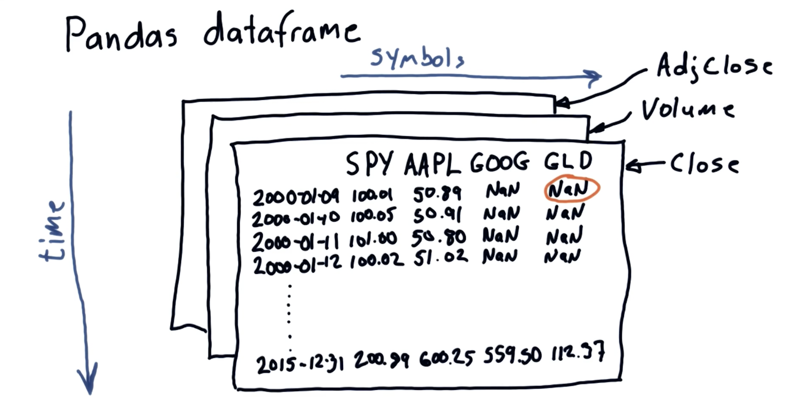
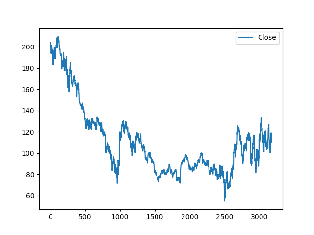
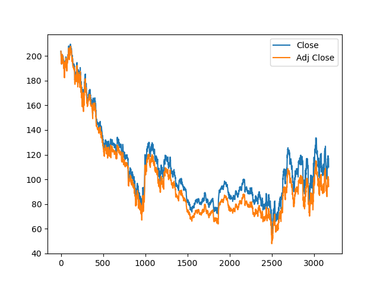

# Data Analysis

- Numpy provides a multidimensional array object to store homogeneous or heterogeneous data arrays and supports vectorization of code.

### Vector dot product

**a · b** = **aᵀ b** = Σ<sub>d=1</sub><sup>D</sup> (a<sub>d</sub> b<sub>d</sub>)

- Where **D** is the dimension of the vectors, and **a<sub>d</sub>** and **b<sub>d</sub>** are the components of **a** and **b** at dimension **d**.

### Matrix Multiplication (C = AB)

C<sub>i,j</sub> = A<sub>i,1</sub>B<sub>1,j</sub> + A<sub>i,2</sub>B<sub>2,j</sub> + A<sub>i,3</sub>B<sub>3,j</sub> + ... + A<sub>i,K</sub>B<sub>K,j</sub> = Σ<sub>k=1</sub><sup>K</sup> A<sub>i,k</sub> B<sub>k,j</sub>

- Where -

  - **C<sub>i,j</sub>** represents the element in the i-th row and j-th column of matrix **C**,
  - **A<sub>i,k</sub>** represents the element in the i-th row and k-th column of matrix **A**,
  - **B<sub>k,j</sub>** represents the element in the k-th row and j-th column of matrix **B**, and
  - **K** is the number of columns in matrix **A** (or equivalently, the number of rows in matrix **B**).

- If **A** has shape **M x N** and **B** has shape **N x P** then **C = AxB** will have shape **M x P**. Note that the #Columns in **A** must be same as #Rows in **B**.

### Element-wise matrix product (C = A ⊙ B)

C<sub>i,j</sub> = A<sub>i,j</sub> \* B<sub>i,j</sub>

- Where -

  - **A** and **B** are matrices of the same size (M x N),
  - **C** is the resulting matrix of the same size (M x N),
  - **C<sub>i,j</sub>** represents the element in the i-th row and j-th column of matrix **C**,
  - **A<sub>i,j</sub>** represents the element in the i-th row and j-th column of matrix **A**,
  - **B<sub>i,j</sub>** represents the element in the i-th row and j-th column of matrix **B**.

- Each element of **C** is the product of the corresponding elements of **A** and **B**.

### Pandas DataFrames

- 3-D Pandas DataFrame representation -
  

- `pd.read_csv("file_path")` - reading csv files
- `print(df)` - prints entire dataframe
- `df.head` - returns top 5 lines of the dataframe
- `df.tail` - returns last 5 lines of the dataframe
- `df[10:21]` - returns 10th to 20th lines. Note that the end index (21) is exclusive.
- `df['Close'].max()` - returns maximum value in `Close` column
- `df['Close'].mean()` - returns mean value in `Close` column
- `df.dropna()` - drops rows where `NaN` values are present in any column
- `df.dropna(subset='SPY')` - drops rows where `SPY` column is `NaN`
- `df[start_idx:end_idx, ['A', 'B']]` - returns dataframe containing rows between `start_idx` and `end_idx`, containing only `A` and `B` columns

### Plotting

- Plotting single column -

```
import matplotlib.pyplot as plt

df['Adj Close'].plot()
plt.show()
```



- Plotting two columns on a single graph -

```
df[['Close', 'Adj Close']].plot()
plt.show()
```



- Plot parameters -

```
ax=df.plot(title="Stock prices", fontsize=2)
ax.set_xlabel('Date')     # Horizontal axis label
ax.set_ylabel('Price')    # Vertical axis label
plt.show()
```

- Creating empty dataframe -

```
start_date='2010-01-22'
end_date='2010-01-26'

dates=pd.date_range(start_date,end_date)   # returns <class 'pandas.tseries.index.DatetimeIndex'>
date[0]                                    # returns the first index i.e. 2010-01-22 00:00:00

df=pd.DataFrame(index=date)
```

- Using `Date` column as index -

```
df.read_csv('file_path',
            index_col='Date',
            parse_dates=True,
            use_cols=['Date', 'Adj Close'],   # imports only 'Date' and 'Adj Close' columns
            na_values=['nan'])                # read `NaN` values as a number, not a string
```

- Joins -

  - `df1.join(df2)` - left-join
  - `df1.join(df, how='inner')` - inner join

- Rename columns - `df1.rename(columns={'Adj Close':'SPY'})` - renames `Adj Close` column to `SPY`

- Slicing -

  - `df.ix['2010-01-01':'2010-01-31']` - slice by row ranges - returns data for January month
  - `df.ix['2010-01-01':'2010-01-31', ['SPY', 'IBM']]` - slice by row ranges and only takes two columns - `SPY` and `IBM`

- Normalizing multiple stocks to start with same value (eg - 1.0) - `df / df.ix[0, :]` - divides all the rows by the first row for each corresponding column.
