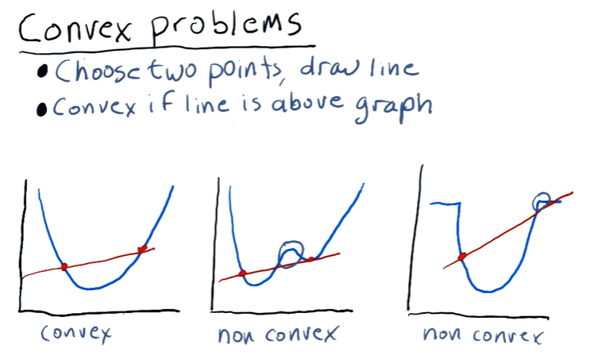
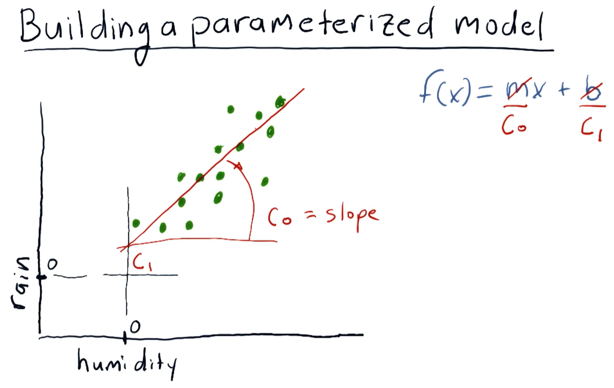

# Optimizer

- Uses -
    - Find minimum values of functions.
    - Build parameterized models based on data.
    - Refine allocations to stocks in portfolio.

- How to use -
    - Define a function to minimize.
    - Provide an initial guess.
    - Call the optimizer - the optimizer starts with the guess, repeatedly calls the function on different values and narrows in on the solution.

- Example -
```
import pandas as pd
import numpy as np
import matplotlib.pyplot as plt
import scipy.optimize as spo

def f(X):
    Y = (X - 1.5)**2 + 0.5
    print "X = {}, Y = {}".format(X, Y)
    return Y

Xguess = 2.0
min_result = spo.minimize(f, Xguess, method='SLSQP', options={'disp': True})   # disp = True for verbose output
print "Minima found at:"
print "X = {}, Y = {}".format(min_result.x, min_result.fun)

# Plot function values, mark minima
Xplot = np.linspace(0.5, 2.5, 21)
Yplot = f(Xplot)
plt.plot(Xplot, Yplot)
plt.plot(min_result.x, min_result.fun, 'ro')
plt.title("Minima of an objective function")
plt.show()
```

- Defining specific range of values of X can make optimizers run faster.
- Constraints on values of X should also be specified, for eg - sum of allocations must be equal to 1

## Convex Functions

- A real-valued function is called **convex** if the line segment between any two distinct points on the graph of the function lies above or on the graph between the two points.



- A Convex function -
    - Should only have one local minima.
    - Cannot have any flat regions.

## Building a parameterized model



- The objective is to find equation of a line (`c₀`, `c₁` coefficients) that best fits the data points. We can consider the distance of each point from the line and can form an equation to minimize, for eg - 
    - $$ \sum_{i} |e_i| $$ 
    - $$ \sum_{i} e_i^2 $$


