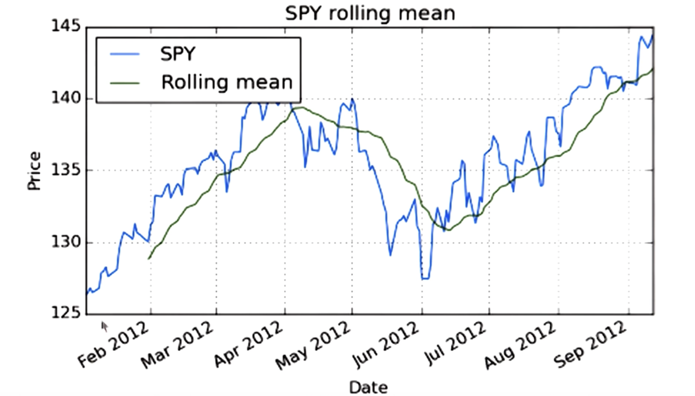
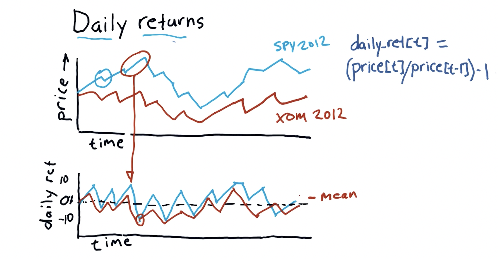
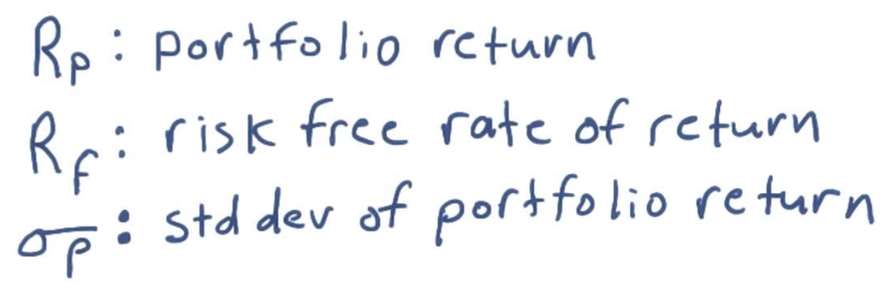
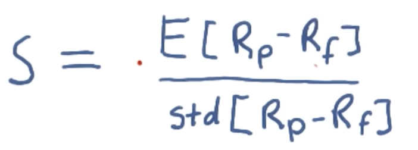
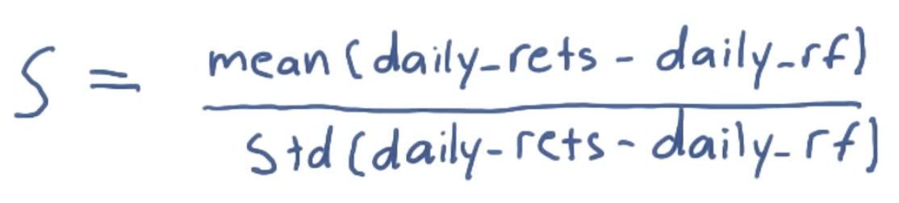

## Rolling Statistics

- Computing statistics (eg. mean) of rolling windows with pre-defined size, say 20 days. For each 20 days, compute the mean and plot it.
  
- Rolling std can be used to identify when the actual graph is far enough to buy or sell from the rolling mean.
- **Bollinger Bands** - When the graph is 2 std times downward or upward (called lower and upper bands) than the rolling std, then it is a buy or sell signal.
- Calculating rolling mean -

```
ax =df['SPY'].plot(title='SPY rolling mean', label='SPY')

rm_SPY = pd.rolling_mean(
  df['SPY'],        # the column for which the rolling means has to be calculated
  window=20,        # window size of 20 days
)

rm_SPY.plot(label='Rolling mean', ax=ax)    # axis object (ax) will add it to the existing plot

ax.set_xlabel('Date')
ax.set_ylabel('Price')
ax.legend(loc='upper left')

plt.show()
```



- Computing Bollinger Bands -

  - Compute rolling mean - `pd.rolling_mean(df['SPY'], window=20)`
  - Compute rolling standard deviation - `pd.rolling_std(df['SPY'], window=20)`
  - Compute upper and lower bands -

  ```
  def get_bollinger_bands(rm, rstd):
    upper_band = rm + rstd* 2
    lower_band = rm - rstd * 2
    return upper_band, lower_band
  ```

### Daily Returns

- Daily returns signifies the price changes on a particular day.
- The daily return for day `t` can be calculated as - `dr[t] = (price[t] / price[t-1]) - 1`
  

```
def compute_daily_returns(df):
  daily_returns = df.copy()
  df[1:] = (df[1:] / df[:-1].values) - 1  # Compute daily returns for row 1 onwards
  daily_returns.ix[0, :] = 0              # Set daily returns row_0 to 0
  return daily_returns
```

- Concise way -

```
def compute_daily_returns(df):
  daily_returns = (df / df.shift(1)) - 1
  daily_returns.ix[0, :] = 0              # Pandas leaves the 0th row full of NaNs
  return daily_returns
```

### Cummulative Returns

- Change in price from the beginning till today.
- For day `t` - `cum_ret[t] = (price[t] / price[0]) - 1`

## Daily Portfolio

- Given -
  - Starting value = 1 million
  - Start date = 2009-01-01
  - End date = 2011-12-31
  - Symbols = ['SPY', 'XOM', 'GOOG', 'GLD']
  - Allocations = [0.4, 0.4, 0.1, 0.1]

- Question - How do we calculate the total value of the portfolio day by day?

- Steps -
  - Create df of stock prices day-by-day.
  - Normalize the prices - `normed = prices / prices[0]`
  - Allocated df - `alloced = normed * allocations`
  - Multiply with starting value - `pos_val = alloced * start_val`
  - Calculate total value each day by summing rows i.e. daily portfolio - `port_vals = pos_vals.sum(axis = 1)`

- We then calculate daily returns from daily portfolio values.

- From the daily returns, we calculate 4 key statistics -
  - Cummulative return (`cum_ret`)
  - Average daily return (`avg_daily_ret`)
  - Standard deviation of daily return (`std_daily_ret`)
  - Sharpe ratio (`sharpe_ratio`)

## Sharpe Ration

- Sharpe ratio is a metric to determines the adjusted return given risk (stock volatility).
- Also considers risk free rate of return i.e. interest rate you get on your money if you include it in a risk free asset.

- Given -



Sharpe ration is calulated as - 



i.e.



- Shortcut to calculate risk free rate can be calculated _annually_ as -  `daily_rf = \(\sqrt[252]{\text{value} + \text{interest}} - 1\)`
- But we generally consider the risk free rate as 0.

> [!TIP]
> We can drop the subtraction of risk free rate from denominator because it is a constant value and standard deviation will not be changed.

- Sharpe Ratio is an annual measure. So, if we are sampling the frequencies other than annual, we need to add an adjustment factor to it (K) - `Annualised_SR = K * SR`, where `K = \(\sqrt{\text{#Samples per year}}\)`
Therefore -
  - Daily K = `sqrt(252)`
  - Weekly K = `sqrt(52)`
  - Monthly K = `sqrt(12)`

- Note that if we are sampling daily and we take samples for 85 days, the K will still be `sqrt(252)`.

- Example -
  - Given -
    - 60 days of data
    - Average daily return = 10 bps = 0.0010
    - Daily risk free rate = 2 bps = 0.0002
    - Standard deviation of daily returns = 10 bps = 0.0010
  - Sharpe Ratio = `sqrt(252) * ((10 - 2) / 10) = 12.7`


