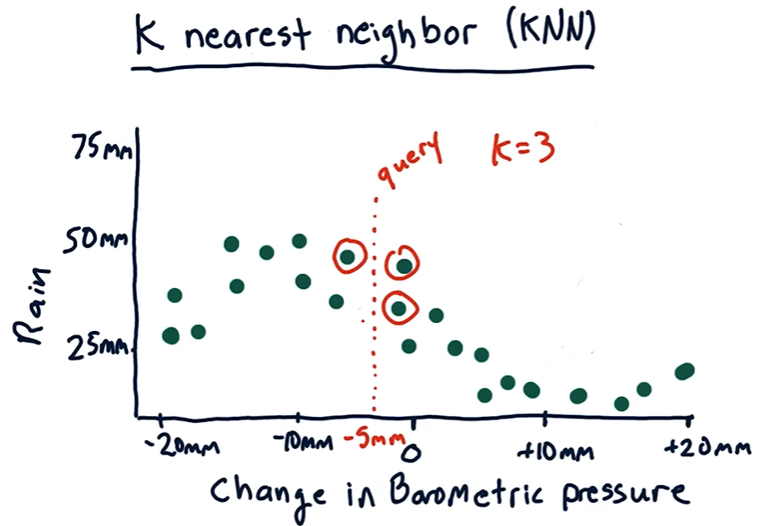

## Backtesting

- Take some historical data for model training and find the future predictions.
- Move the training data to later point in time and then again find the future predictions.
- Repeat the process.

## Problems with regression

- Forecasts are noisy and uncertain.
- Challenging to estimate confidence.
- Unclear about holding time, allocations etc.

## Parametric Regression

- Models are represented using _parameters_. Eg -
    - Linear regression (y = mx + b) - the parameters are m and b
    - Polynomial regression (y = m22 + m1 + b) - the parameters are m2, m1 and b

- We don't have to store training data so it is very space efficient.
- But we cannot easily update the model as we gather more data - usually requires complete rerun.
- Therefore, model training is slow but querying is fast.

## Instance-based Regression

- Used when the problem is hard to model mathematically.
- Models are represented using _instance data_. Eg - K Nearest Neighbor -

- In _Kernel Regression_, we weight the contributions of each of the contributions of each nearest data points according to how distant they are. Whereas in _KNN_, each data point gets equal weight.

- We have to store all the data points.
- Easy to update the model since no parameters need to be learned.
- Therefore, model training is fast but querying is slow.

> [!TIP]
> **Out of Sample Testing** - splitting the data into training and test sets.

> [!WARNING]
> For time-oriented datasets, we typically split the data according to time - train model on older data and test on newer data. We should not do the reverse because there are certain look-ahead biases that can occur.
