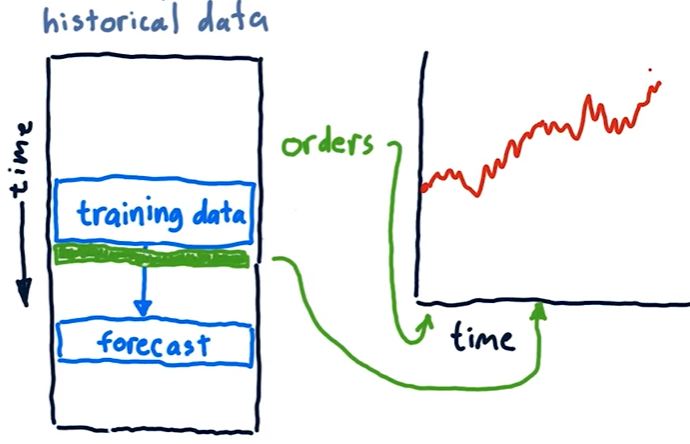

## Backtesting

- Take some historical data for model training and find the future predictions.
- Move the training data to later point in time and then again find the future predictions.
- Repeat the process.

## Problems with regression

- Forecasts are noisy and uncertain.
- Challenging to estimate confidence.
- Unclear about holding time, allocations etc.

## Parametric Regression

- Models are represented using _parameters_, for eg -
    - Linear regression (y = mx + b) - the parameters are m and b
    - Polynomial regression (y = m22 + m1 + b) - the parameters are m2, m1 and b