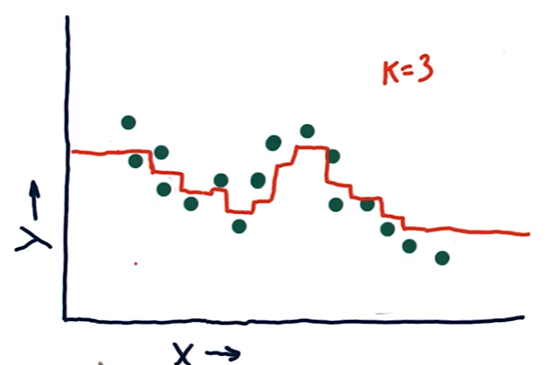
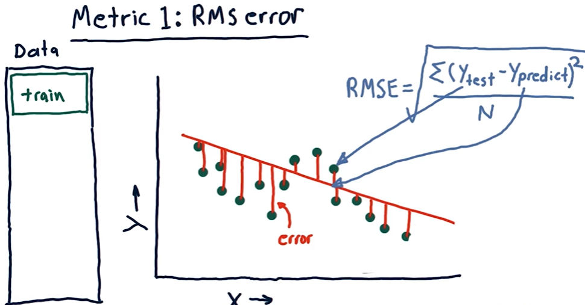
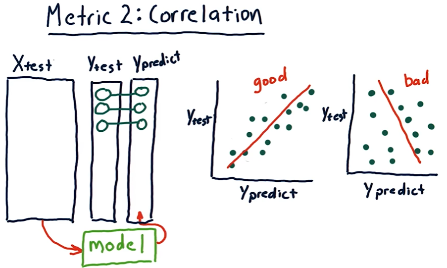
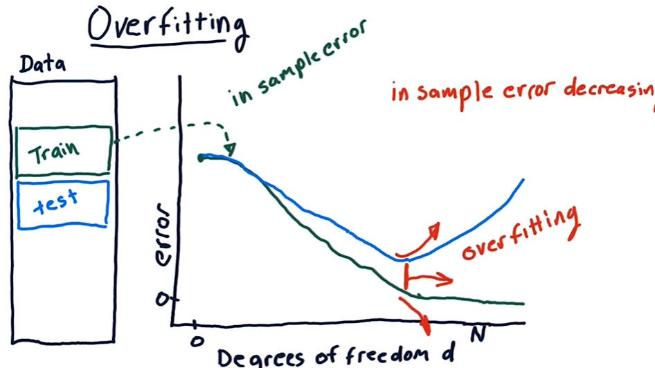
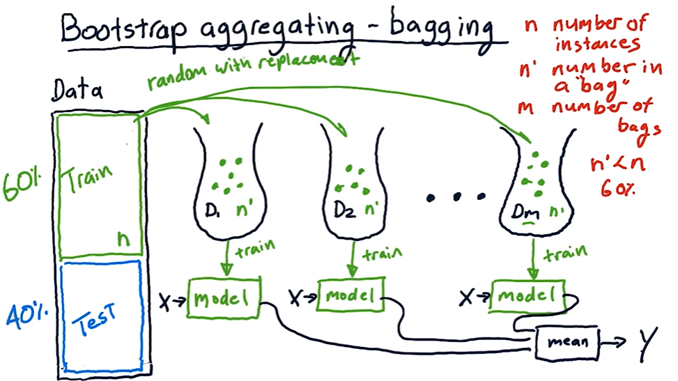

## Backtesting

- Take some historical data for model training and find the future predictions.
- Move the training data to later point in time and then again find the future predictions.
- Repeat the process.

## Problems with regression

- Forecasts are noisy and uncertain.
- Challenging to estimate confidence.
- Unclear about holding time, allocations etc.

## Parametric Regression

- Models are represented using _parameters_. Eg -
    - Linear regression (y = mx + b) - the parameters are m and b
    - Polynomial regression (y = m22 + m1 + b) - the parameters are m2, m1 and b

- We don't have to store training data so it is very space efficient.
- But we cannot easily update the model as we gather more data - usually requires complete rerun.
- Therefore, model training is slow but querying is fast.

## Instance-based Regression

- Used when the problem is hard to model mathematically.
- Models are represented using _instance data_. Eg - K Nearest Neighbor -

- In _Kernel Regression_, we weight the contributions of each of the contributions of each nearest data points according to how distant they are. Whereas in _KNN_, each data point gets equal weight.

- We have to store all the data points.
- Easy to update the model since no parameters need to be learned.
- Therefore, model training is fast but querying is slow.

> [!TIP]
> **Out of Sample Testing** - splitting the data into training and test sets.

> [!WARNING]
> For time-oriented datasets, we typically split the data according to time - train model on older data and test on newer data. We should not do the reverse because there are certain look-ahead biases that can occur.

- Closer look at KNN -

- As we move forward w.r.t X, the nearest neighbors changes and we can plot the values.
- The benefit of KNN is that it does not overfit the data. The downside is we get horizontal lines because of constant predictions for the period when the nearest neighbors remain the same.
- As we increase k, we are more likely to underfit.

## Root Mean Square (RMS) Error

## Correlation

- `np.corrcoef()` to find the correlation between two vectors.
- Correlation value ranges from -1 to +1 -
    - +1 = high correlation
    - -1 = inverse correlation
    - 0 = No correlation

- Points closer to the line - high correlation. If more spread out - low correlation.

- In most cases, as RMS error increases, correlation goes decreases. But, in some rare cases, the correlation may increase. Thus, we really can't be sure.

## Overfitting

## Ensemble Learners

- Ensemble learners reduce the bias of individual learners.
- **Bootstrap Aggregating (Bagging)** - train each learner on different set of data - can be sampled random with replacement.

- **Boosting** -
    - Steps -
        - Select sample randomly from the training data and train model on it.
        - Use the training data to test the model.
        - Some of the points will not be well-predicted.
        - Create another bag with random sampling - but each instance is weighted according to the error i.e. high-error instances are more likely to get picked.

    - AdaBoost is commonly used model for boosting.
    - AdaBoost tries to assign more and more specific data points to subsequent learners, trying to model all the difficult examples. Thus, compared to simple bagging, it may result in more overfitting.
