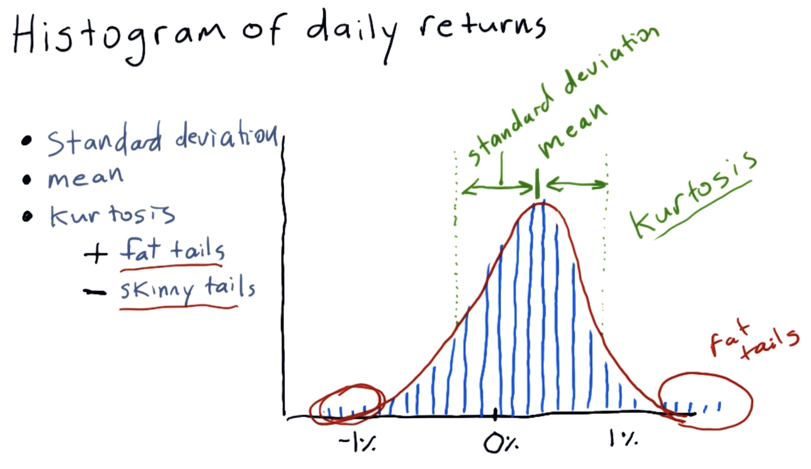
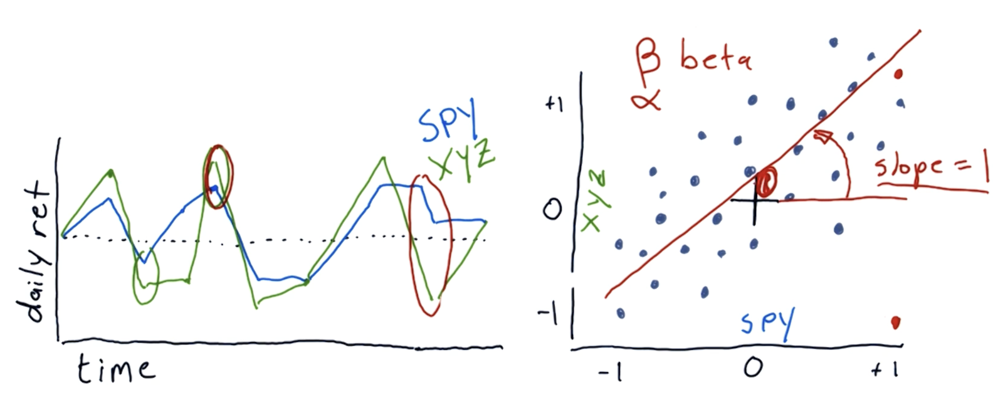

## Histograms



- Plotting a histogram -

```
df.hist(bins=20)
plt.show()
```

- Plotting mean and std on the plot -

```
mean = df['SPY'].mean()
std = df['SPY'].std()

plt.axvline(mean, color='w', linestyle='dashed', linewidth=2)
plt.axvline(std, color='r', linestyle='dashed', linewidth=2)
plt.axvline(-std, color='r', linestyle='dashed', linewidth=2)   # std lines will be plotted on both sides of the mean
plt.show()
```

- Calculating kurtosis - `df.kurtosis()`

- Plotting two histograms together -

```
df['SPY'].hist(bins=20, label='SPY')
df['XOM'].hist(bins=20, label='XOM')

plt.legend(loc='upper right')
plt.show()
```

## Scatterplots



- The slope (beta) is 1 means when the market goes up 1% then the stock will also up 1%.
- Alpha is where the line intercepts y-axis. If alpha is positive, the stock performance is good.

> [!NOTE]
> Slope is not equal to correlation. Correlation is a measure of how tightly the points fit the line. 0 means no correlation and 1 means highly correlated.
> To find correlation - `df.corr(method='pearson')`

- Plotting scatterplots -

```
df.plot(kind='scatter', x='SPY', y='XOM')
plt.show()
```

- Plotting

```
beta_XOM, alpha_XOM = np.polyfit(df['SPY'], df['XOM'], 1)   # 1 is the degree of polynomial i.e. y = mx + c
plt.plot(df['SPY'], beta_XOM * df['SPY'] + alpha_XOM, '-', color='r')
plt.show()
```
