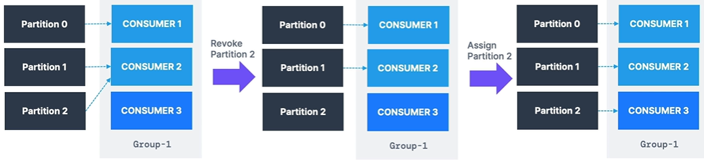
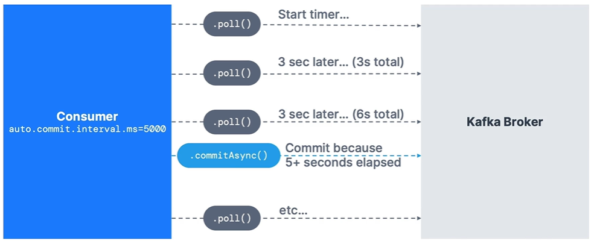

# Kafka Java SDK

## Kafka Producer

```
// create producer properties
var properties = new Properties();
properties.setProperty("bootstrap.servers", "<host>");
properties.setProperty("key.serializer", StringSerializer.class.getName());
properties.setProperty("value.serializer", StringSerializer.class.getName());

// create the producer
var producer = new KafkaProducer<String, String>(properties);

// create a producer record
var record = new ProducerRecord<String, String>(topic, key, value);

// send data
producer.send(record);

// flush the producer - tells the producer to send all the data and block until done - synchronous
producer.flush();

// close the producer - it internally also calls producer.flush()
producer.close();
```

- __Callbacks__ - 
  - The producer confirms the partition and offset the message was sent to using callbacks.
  ```
  producer.send(record, new Callback() {
    @Override
    public void onCompletion(RecordMetadata metadata, Exception e) {
      // executes every time a record is successfully sent or an exception is thrown
      if (e == null) {
        log.info("Received metadata \n" +
                  "Topic: " + metadata.topic() + "\n" +
                  "Partition: " + metadata.partition() + "\n" +
                  "Offset: " + metadata.offset() + "\n" +
                  "Timestamp: " + metadata.timestamp());
      } else {
        log.error("Error while producing", e);
      }
    }
  })
  ```

- __StickyPartitioner__ -
  - If we send multiple messages quickly, the producer put those messages in a single batch to optimize the performance.
  - Configure batch size - set `batch.size` in producer properties, default is `16 KB`.

> [!TIP]
> To check which partitioner is used - check `partitioner.class` in the logs.
> 
> `partitioner.class = null` means default partitioner - which happens when we don't specify the key.

## Kafka Consumer

```
// create consumer properties
var properties = new Properties();
properties.setProperty("bootstrap.servers", "<host>");
properties.setProperty("key.deserializer", StringSerializer.class.getName());
properties.setProperty("value.deserializer", StringSerializer.class.getName());
properties.setProperty("group.id", "my-app");
properties.setProperty("auto.offset.reset", "earliest");

// create the consumer
var consumer = new KafkaConsumer<String, String>(properties);

// subscribe to a topic
consumer.subscribe(Arrays.asList(topic));

// poll for data
while (true) {
  ConsumerRecord<String, String> records = consumer.poll(Duration.ofMillis(1000));
  for (ConsumerRecord<String, String> record: records) {
    log.info("Key: " + record.key() + ", Value: " + record.value());
    log.info("Partition: " + record.partition() + ", Offset: " + record.offset());
  }
}
```

- __`auto.offset.reset`__ possible values -
  - `none` - fails if consumer group doesn't exist
  - `earliest` - read from the beginning of the topic (`--from-beginning` option in CLI)
  - `latest` - read only the latest messages

- __Graceful Shutdown__ -
  ```
  final Thread mainThread = Thread.currentThread();

  Runtime.getRuntime().addShutdownHook(new Thread() {
      public void run() {
        log.info("Shutting down");
        consumer.wakeup();

        // join the main thread to allow the code execution in the main thread
        try {
          mainThread.join();
        } catch (InterruptedException e) {
          e.printStacktrace();
        }
      }
  });
  ```

  - After `consumer.wakeup()` is called, the next time when consumer polls, a `WakeupException` is thrown.
  - Therefore, also wrap the `while (true) ... consumer.poll() ...` in try-catch block.

- __Partition rebalancing__ -
  - Moving partitions between consumers
  - Happens when -
    - a consumer leaves or joins a group
    - an admin adds new partition into a topic
  - __Eager Rebalance__ (default) -
    - All consumers stop, giving up their membership of partitions.
    - They rejoin the consumer group and get a new partition assignment randomly.
    - During a short period of time, the entire consumer group stops processings - _stop-the-world event_
    - Consumers don't necessarily get back the partitions as they used to have.
  - __Cooperative Rebalance / Incremental Rebalance__ -
    - Reassigs a small subset of the partitions from one consumer to another.
    - Other consumers that don't have reassigned partitions can still process uninterrupted.
    - Can go through several iterations to find a stable assignments (hence "incremental").
    - Avoids stop-the-world events.
  
    

- __Rebalance Strategies__ -
  - `partition.assignment.strategy`
  - Eager strategies -
    - `RangeAssignor` - assigns partitions on a per-topic basis (can lead to imbalance).
    - `RoundRobin` - assign partitions across all topics in round-robin fashion, optimal balance.
    - `StickyAssignor` - balanced like RoundRobin, and then minimizes partition movements when consumer join/leave the group in order to minimize movements.
  - Cooperative strategies -
    - `CooperativeStickyAssignor` - rebalance strategy is identical to StickyAssignor but supports cooperative rebalances and therefore consumers can keep on consuming from the topic.

> [!TIP]
> The default assignor is `[RangeAssignor, CooperativeStickyAssignor]`, which will use the RangeAssignor by default, but allows upgrading to the CooperativeStickyAssignor with just a single rolling bounce that removes the RangeAssignor from the list.

> [!TIP]
> Cooperative rebalance is enabled by default in - 
>   - Kafka connect
>   - Kafka streams - turned on using StreamsPartitionAssignor

- __Static Group Membership__ -
  - By default, when a consumer leaves a group, its partitions are revoked and re-assigned.
  - If it joins back, it will have a new "member ID" and new partitions assigned.
  - If `group.instance.id` is specified, it makes the consumer a static member -
    - If the consumer leaves the consumer group, its partition will not be assigned to any other consumer.
    - Upon leaving, the consumer has up to `session.timeout.ms` to join back and get its partitions (else they will be re-assigned), without triggering a rebalance.
  - This is helpful when consumers maintain local state and cache (to avoid rebalancing the cache).

- __Auto Offset Commit Behavior__ -
  - In the Java Consumer API, offsets are regularly commited.
  - Enable at-least-once reading scenario by default.
  - Offsets are committed when you call `.poll()` and `auto.commit.interval.ms` has elapsed.
  - Example - `auto.commit.interval.ms=5000` and `enable.auto.commit=true` will commit every 5 seconds.
  - Make sure all messages are succesfully processed before you call `.poll()` again -
    - If you don't, you will not be in at-least-once reading scenario.
    - In that case, you must disable `enable.auto.commit`, and most likely, most processing to a separate thread, and then from time-to-time call `.commitSync()` and `.commitAsync()` with the correct offsets manually.

  


  