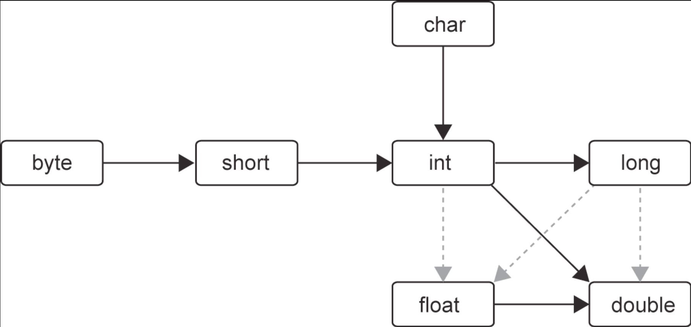

# Data Types

## Integer Type

- Java uses _signed two's completement scheme_ to represent integers.
- The ranges of the integer types do _not_ depend on the machine on which you will be running the Java code.

| Type    | Storage Requirement | Range (Inclusive)              | Default | Min Value           | Max Value           |
|---------|---------------------|--------------------------------|---------|---------------------|---------------------|
| `byte`  | 1 byte              | $–2^7 \text{ to } 2^7−1$       | 0       | `Byte.MIN_VALUE`    | `Byte.MAX_VALUE`    |
| `short` | 2 bytes             | $–2^{15} \text{ to } 2^{15}−1$ | 0       | `Short.MIN_VALUE`   | `Short.MAX_VALUE`   |
| `int`   | 4 bytes             | $–2^{31} \text{ to } 2^{31}−1$ | 0       | `Integer.MIN_VALUE` | `Integer.MAX_VALUE` |
| `long`  | 8 bytes             | $–2^{63} \text{ to } 2^{63}−1$ | 0       | `Long.MIN_VALUE`    | `Long.MAX_VALUE`    |

| Number Type        | Prefix / Suffix          | Example       | 
| ------------------ | ------------------------ | ------------- |
| Long Integer       | Ends with `L` or `l`     | `4000000000L` |
| Hexadecimal Number | Starts with `0x` or `0X` | `0xCAFE`      |
| Octal Number       | Starts with `0`          | `010`         |
| Binary Number      | Starts with `0b` or `0B` | `0b1001`      |

> [!TIP]
> Use underscores in long numbers for readability, eg - `1_000_000` - Java compiler simply ignores the underscores.

- __Unsigned__ -
  - Java has no unsigned `byte`, `short`, `int`, or `long` types.
  - You can treat signed values as unsigned when negatives aren’t needed.
  - Example - `byte` normally `-128..127` → interpret as `0..255`.
  - For safe operations - convert using `Byte.toUnsignedInt(b)` → process → cast back if needed.
  - Similarly, `Integer` and `Long` provide unsigned divide and remainder methods.

## Floating-Point Type

| Type     | Storage Requirement | Range                          | Default | Precision            |
| -------- | ------------------- | ------------------------------ | ------- | -------------------- |
| `float`  | 4 bytes             | $±3.4 × 10^{38}$ (7 digits)    | `0.0f`  | 6-7 decimal digits   |
| `double` | 8 bytes             | $±1.8 × 10^{308}$ (15 digits)  | `0.0d`  | 15-16 decimal digits |

- `Float.floatToFloat16` / `Float.float16ToFloat` store 16-bit half-precision floats in a short (useful for ML).
- Exponentials - 
  - `E` or `e` denotes a decimal exponent
  - Eg - `1.729E3 = 1729` 
- Hex floating literals -
  - `p` = exponent (base `2`), mantissa = hex, exponent = decimal
  - Eg - `0x1.0p-3 = 0.125`

- IEEE 754 special values -
  - Positive infinity, eg - `Positive number / 0` → `Positive infinity`
  - Negative infinity, eg - `Negative number / 0` → `Negative infinity`
  - `NaN` (Not a Number), eg - `0.0 / 0` → `NaN`, `sqrt(negative number)` → `NaN`

> [!NOTE]
> All “not a number” values (for both `Double` and `Float`) are considered distinct, therefore you _cannot_ use `x == Double.NaN` because it will always return `false`. 
>
> Better way - `Double.isNaN(x)`.

> [!NOTE]
> There are both positive and negative floating-point zeroes, `0.0` and `-0.0`, but `0.0 == -0.0` will always return `true`. 
>
> To check whether a value is negative zero, use this test - `Double.compare(x, -0.0) == 0`.

> [!WARNING]
> Floating-point numbers are not suitable for financial calculations because they can produce roundoff errors (e.g., `2.0 - 1.1` prints `0.8999999999999999`).
>
> Use `BigDecimal` for exact precision.

## `char` type

- `char` literals use _single quotes_, e.g., `'A'` = 65.
- Data representation -
  - Bit depth - 16 bits unsigned integer
  - Value range - $0 \text{ to } 2^{16}−1$
  - Default - `\u0000`
- `char` values can be written in hexadecimal from `\u0000` to `\uFFFF`.
- Escape sequences work in both `char` and `String` literals, e.g., `'\u005B'`, `"Hello\n"`.
- The `\u` escape sequence _can also be used outside quotes_, e.g.,
  - `void main()\u007BIO.println("Hello, World!");\u007D`
  - `\u007B` and `\u007D` are the encodings for `{` and `}`

> [!WARNING]
> Unicode escape sequences are processed before the code is parsed.
>
> Eg - 
>   - `"\u0022+\u0022"` is not a string consisting of a plus sign surrounded by quotation marks (`U+0022`)
>   - Instead, the `\u0022` are converted into `"` before parsing, yielding `""+""`

> [!WARNING]
> Beware of `\u` inside comments.
>
> Eg - `// \u000A is a newline` - yields a syntax error since `\u000A` is replaced with a newline when the program is read.

- You can use any number of `u` in a Unicode escape (e.g., `\u00E9` and `\uuu00E9` both mean `é`). 
  - This makes ASCII-only conversions reversible - a tool can add extra `u`'s to existing escapes and later restore them.

> [!TIP]
> Each primitive wrapper has two constants -
>   - `<Type>.SIZE` - size in bits
>   - `<Type>.BYTES` - size in bytes
>
> Example -
>   - `Integer.SIZE` - 32
>   - `Integer.BYTES` - 4

## `boolean` type

- The boolean type has two values - `true` and `false`. 
- Used for evaluating logical conditions. 
- You cannot convert between integers and boolean values, eg - `if (x = 0)` does not compile because the integer expression `x = 0` cannot be converted to a `boolean` value.

## Enum Type

- Used when a variable should hold only a _fixed set of values_.
- Example -

  ```
  enum Size { SMALL, MEDIUM, LARGE, EXTRA_LARGE }

  Size s = Size.MEDIUM;           // declare variables of the enum type
  Size.valueOf("MEDIUM");         // returns Size.MEDIUM
  Size.valueOf("Medium");         // Error!
  Size.values();                  // returns all Size values in an array
  ```

- Enum type variable (e.g., `Size`) can only hold one of its defined values or `null` if it’s not set.

## Arithmetic Operators

- `+`, `-`, `*`, `/`
- Division -
  - `int / int` returns `int`.
  - If anything is float/double, the result is float/double.
- Division by `0` -
  - `int / 0` throws an exception.
  - `float or double / 0` returns `Infinity`.
- Modulus `n % 2` -
  - `0` for even `n`.
  - `1` for odd positive `n`.
  - `-1` for odd negative `n`.
- `Math.floodMod` -
  - `Math.floorMod(-5, 2)` returns `1`.
  - `Math.floorMod(5, -2)` returns `-1`.

- __Legal conversions between numeric types__ -

  

  - Solid arrows - conversions without information loss. 
  - Dotted arrows - conversions that may lose precision, eg -
    ```
    int n = 123456789;
    float f = n;            // 1.23456792E8 - magnitude correct, precision lost
    ```
    
  - Binary operators convert operands to a common type before computing -
    - If either operand is `double`, convert the other to `double`.
    - Else if either operand is `float`, convert the other to `float`.
    - Else if either operand is `long`, convert the other to `long`.
    - Else convert both operands to `int`.

- __Casts__ -
  - Conversions in which loss of information is possible are done by means of _casts_ -
    ```
    double x = 9.997;
    int nx = (int) x;           // 9
    ```

  - Java 25 preview adds safe casts using `instanceof` pattern matching.
    - Example - `if (n instanceof byte b)`
    - If `n` fits in a `byte` without loss, `b` is automatically set to `(byte) n`.

> [!NOTE]
> Casting to a smaller numeric type can truncate the value if it’s out of range, eg - `(byte) 300` becomes `44`.

### Assignment Operators

- Compound assignment operators - `+=`, `-=`. `*=`, `/=`, `%=`
- Compound assignment operators perform an implicit cast to the type of the left-hand side - even if the conversion is narrowing.
- Example -
  ```
  int x = 0;
  x += 3.5;                 // returns 3 - fractional part is discarded

  // equivalent to -
  x = (int)(x + 3.5); 

  // but
  x = x + 3.5;              // compiler error!
  ```

  - Java 20+ can warn about such lossy conversions when linting is enabled. To enable such warnings -
    ```
    javac -Xlint:lossy-conversions MyApp.java
    ```

- In Java, an assignment is an _expression_ and returns the assigned value, eg -
  ```
  int x = 1;
  int y = x += 4;           // y = 5
  ```

### Increment & Decrement Operators

- `++`, `--`
- Works on variables, not on literals (e.g., `4++` is illegal).
- Two forms - 
  - Prefix (`++x` / `--x`) - value is changed before being used in an expression.
  - Postfix - (`x++` / `x--`) - value is used first, then changed.

- Example -
  ```
  int m = 7;
  int n = 7;

  int a = 2 * ++m;              // a = 16, m = 8
  int b = 2 * n++;              // b = 14, n = 8
  ```

### Relational Operators

- Equality (`==`) and inequality (`!=`).
- Comparisons - `<`, `>`, `<=`, `>=`
- Logical operators -
  - Logical AND - `&&`
  - Logical OR - `||`
  - Logical NOT - `!`
- __Short-circuit Evaluation__ -
  - `&&` stops evaluating if the first operand is `false`.
  - `||` stops evaluating if the first operand is `true`.

- __Conditional Operator (`?:`)__ -
  - Syntax - `condition ? expression1 : expression2`
  - Returns `expression1` if condition is `true`, otherwise returns `expression2`.

### Bitwise Operators

- Work on bit patterns - `&` ("and"), `|` ("or"), `^` ("xor"), `~` ("not").
- `&` and `|` work on boolean values also and return `boolean` - similar to `&&` and `||` - but they do not provide short-circuiting.

- __Bit Shift operators__ -
  - `<<` - left shift
  - `>>` - right shift (sign-extends the leftmost bit)
  - `>>>` - unsigned right shift (fills leftmost bits with 0)
  - No `<<<` operator exists

- __Integer Bit-level Methods__ -
  - `Integer.bitCount(n)` - number of 1 bits in binary form of `n`.
  - `Integer.reverse(n)` - reverses bits of `n`.

## Big Numbers

- `java.math.BigInteger` -
  - Used for very large integer arithmetic.
  - Can hold numbers with any number of digits.
  - From a normal number - `BigInteger.valueOf(100)`
  - From a long number (string) - `new BigInteger("123456")`
  - Constants - `BigInteger.ZERO`, `BigInteger.ONE`, `BigInteger.TWO`, `BigInteger.TEN`

- `java.math.BigDecimal` -
  - Used for very precise decimal numbers (money, financial calculations, etc.)
  - Always construct from integers or string.
  ```
  new BigDecimal(0.1);      // avoid - returns 1000000000000000055511151231257827021181583404541015625
  BigDecimal.valueOf(0.1);  // returns 0.1
  new BigDecimal("0.1");    // returns 0.1
  ```

- Cannot use arithmetic operators like `+`, `-`, `*`, `/` - because Java does not support operator overloading.

> [!NOTE]
> Only exception - `+` is overloaded for string concatenation.

- Instead use methods -
```
BigInteger c = a.add(b);  // c = a + b
BigInteger d = c.multiply(b.add(BigInteger.valueOf(2)));      // d = c * (b + 2)
```

> [!TIP]
> Java 19 feature - `parallelMultiply()` - works like `multiply()` but may be faster using multiple CPU cores.

> [!NOTE]
> Division -
>   - `divide(other)` - throws exception if result is not finite (repeating decimal).
>   - `divide(other, mode)` - allows rounding when the result is repeating.
>
> Example - `RoundingMode.HALF_UP`
>   - Round down - 0–4
>   - Round up - 5–9

## Strings

- Java strings are sequences of `char` values.
- The JVM may store strings as byte sequences for single-byte characters and as char sequences for others, rather than always using `char[]`.

- __Strings are immutable__ - 
  - You cannot change a character inside an existing string.
  - Immutable strings allow sharing, so the compiler can store strings in a common pool and multiple variables can reference the same characters without copying.

- __Concatenation__ -
  - Use `+` to concatenate two strings.
  - When you concatenate a string with a non-string value, Java converts the non-string value to a string.
  - Example -
    ```
    int age = 15;
    String rating = "PG" + age;           // "PG15"
    ```

> [!WARNING]
> String concatenation uses + and is evaluated left to right. Therefore, if you concatenate a number after a string, everything becomes a string from that point onward.
> Example -
> ```
> int age = 42;
> String output = "Next year, you'll be " + age + 1 + ".";
> ```
> Result - `"Next year, you'll be 421."`
>
> Fix - use parentheses - 
> ```
> String output = "Next year, you'll be " + (age + 1) + ".";
> ```

> [!WARNING]
> String concatenation only works with strings, not char literals — `':' + 8000` produces the integer `8058`, not a string (The colon character has Unicode value `58`).

> [!WARNING]
> Do not use the `==` operator to test whether two strings are equal! It only determines whether or not the strings are stored in the same location. 
>
> Only string literals are shared, not strings that are computed at runtime. Therefore, never use `==` to compare strings. Always use `equals` instead.

> [!TIP]
> `CharSequence` is the interface type to which all strings belong. 

## `StringBuilder`

- String concatenation is inefficient because each concatenation creates a new String object.
- `StringBuilder` avoids this by building a string in a _mutable buffer_.

- The `String` class doesn’t have a method to reverse the Unicode characters of a string, but `StringBuilder` does - 
  ```
  String reversed = new StringBuilder(original).reverse().toString();
  ```