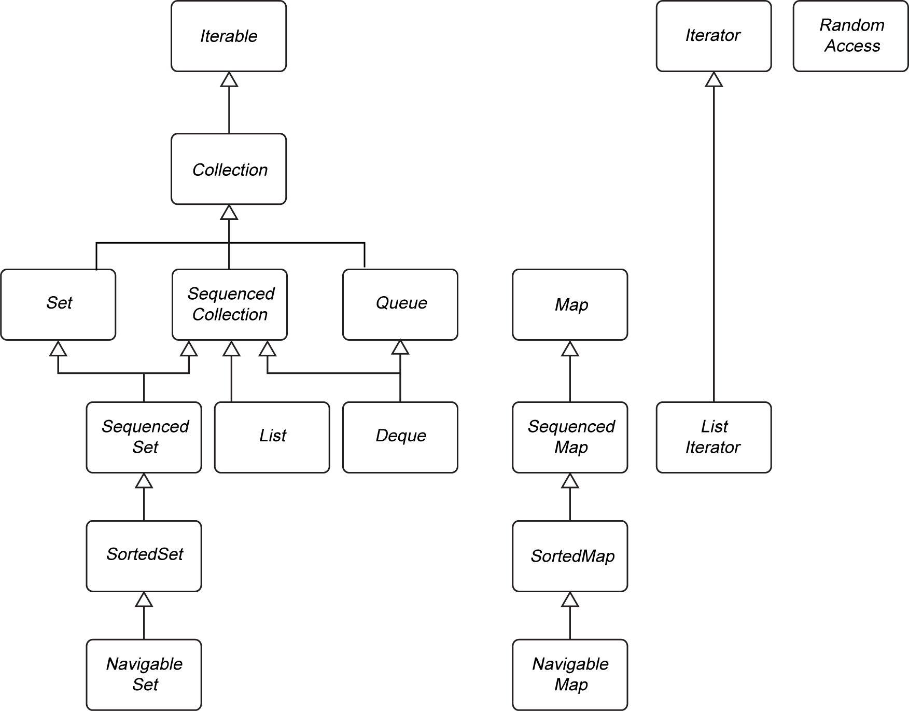

# Collection Framework

## `Iterable` Interface

- The “for each” loop works with any object that implements the `Iterable` interface.
```
public interface Iterable<E> {
  Iterator<E> iterator();
}
```

## `Collection` Interface

- The `Collection` interface extends the `Iterable` interface.
- `java.util.Collection<E>` interface -

| Method                                                      | Description                                                                                          |
| ----------------------------------------------------------- | ---------------------------------------------------------------------------------------------------- |
| `Iterator<E> iterator()`                                    | Returns an iterator to traverse the elements in the collection.                                      |
| `int size()`                                                | Returns the number of elements currently stored in the collection.                                   |
| `boolean isEmpty()`                                         | Returns `true` if the collection contains no elements.                                               |
| `boolean contains(Object obj)`                              | Returns `true` if the collection contains an element equal to `obj`.                                 |
| `boolean containsAll(Collection<?> other)`                  | Returns `true` if the collection contains all elements of the specified collection.                  |
| `boolean add(E element)`                                    | Attempts to add an element; returns `true` if the collection changed as a result.                    |
| `boolean addAll(Collection<? extends E> other)`             | Adds all elements from another collection; returns `true` if the collection changed.                 |
| `boolean remove(Object obj)`                                | Removes an element equal to `obj`; returns `true` if removal occurred.                               |
| `boolean removeAll(Collection<?> other)`                    | Removes all elements present in the specified collection; returns `true` if the collection changed.  |
| `boolean removeIf(Predicate<? super E> filter)` *(Java 8+)* | Removes elements matching the predicate; returns `true` if the collection changed.                   |
| `void clear()`                                              | Removes all elements from the collection.                                                            |
| `boolean retainAll(Collection<?> other)`                    | Retains only elements present in the specified collection; returns `true` if the collection changed. |
| `Object[] toArray()`                                        | Returns an array containing all elements of the collection.                                          |
| `<T> T[] toArray(IntFunction<T[]> generator)` *(Java 11+)*  | Returns an array of elements using the provided array constructor (e.g., `String[]::new`).           |


> [!WARNING]
> The Java Collections Framework was designed before generic types were added to Java. For backwards compatibility, the `contains` and `remove` methods have a parameter of type `Object` and not `E`. The `containsAll`, `removeAll`, and `retainAll` methods have a parameter of type `Collection<?>` and not `Collection<? extends E>`.
>
> This means that type errors may not be detected at compile time.
> Example - accidentally a `String` is removed from a collection of `Path` objects -
> ```
> Collection<Path> paths = . . .;
> paths.remove("/tmp");           // Compiles, but can have no effect
> ```

- To make life easier of the implementors, the framework supplies a class `AbstractCollection` that leaves the fundamental methods `size` and `iterator` abstract but implements the routine methods.

> [!TIP]
> A concrete collection class can now extend the `AbstractCollection` class.
> 
> Mutable collections also need an `add` method.  The other methods have been taken care of by the `AbstractCollection` superclass. 

## Iterators

- `java.util.Iterator<E>` -

| Method                                                          | Description                                                                                                                                                     |
| --------------------------------------------------------------- | --------------------------------------------------------------------------------------------------------------------------------------------------------------- |
| `boolean hasNext()`                                             | Returns `true` if there is another element to iterate over.                                                                                                     |
| `E next()`                                                      | Returns the next element in the iteration; throws `NoSuchElementException` if no elements remain.                                                               |
| `void remove()`                                                 | Removes the last element returned by `next()`. Must be called immediately after `next()`. May throw `IllegalStateException` or `UnsupportedOperationException`. |
| `void forEachRemaining(Consumer<? super E> action)` *(Java 8+)* | Performs the given action for each remaining element until all are processed or an exception occurs.                                                            |

- Traverse all the elements -
  ```
  Collection<String> coll = . . .;
  Iterator<String> iter = coll.iterator();
  while (iter.hasNext()) {
    String element = iter.next();
    // do something with element
  }
  ```

  - More concise way - the compiler simply translates the “for each” loop into a loop with an iterator -
  ```
  for (String element : coll) {
    // do something with element
  }
  ```

- Using `Collection#forEach` or `Iterator#forEachRemaining` for traversing with lambda expression -
```
coll.forEach(element -> do something with element);
iter.forEachRemaining(element -> do something with element);
```

> [!NOTE]
> The order in which the elements are visited depends on the collection type, eg - `ArrayList` will visit the elements from index `0` to the last index, but for `HashSet`, the order can be random.

- It is illegal to call `remove` if it wasn’t preceded by a call to `next` - throws `IllegalStateException`, eg -
```
Iterator<String> iter = coll.iterator();
iter.next();          // skip over the first element
iter.remove();        // now remove it
```

## Interfaces in the Collections Framework



- __Maps__ -
  - Hold key-value pairs -
  - `V put(K key, V value)` - inserts key-value pairs.
  - `V get(Object key)` - returns value for the key.

- __`List`__ -
  - Ordered collection.
  - Elements are added into a particular position in the container.
  - Elements are accessed in two ways -
    - By an iterator - Linked list implementation - elements are visited _sequentially_.
    - By an integer index - Array implementation - called _random access_ because elements can be visited in any order.
    - Array implementation -
      - Has fast random access.
      - 
  - The `List` interface defines several methods for random access -
    ```
    void add(int index, E element)
    E remove(int index)
    E get(int index)
    E set(int index, E element)
    ```

  - `equals` method returns `true` if both the lists have the same elements in the same order.

> [!WARNING]
> `List<Integer` has two `remove` methods -
>   - `boolean remove(int index)` - removes the element with the given index
>   - `boolean remove(Integer o)` - removes the element equal to o

> [!NOTE]
> `RandomAccess` is a tagging interface used to test whether a particular collection supports efficient random access.

- __`Set`__ -
  - `add` method reject duplicates. 
  - `equals` method returns `true` if both the sets have the same elements, irrespective of the ordering of their elements.
  - `hashCode` method is defined such that two sets with the same elements always yield the same hash code.

- The `SortedSet` and `SortedMap` interfaces expose the comparator object used for sorting, and they define methods to obtain views of subsets of the collections.

- The interfaces `NavigableSet` and `NavigableMap` contain additional methods for finding the next or previous element in sorted sets and maps -
  - The `TreeSet` and `TreeMap` classes implement these interfaces.
  - The navigation operations can be efficiently implemented in tree-based data structures.

- __`SequencedCollection<E>`__ (Java 21+) -
  - Provides uniform access to the first and last elements of a collection and reverse traversal.
  ```
  E getFirst()
  E getLast()
  void addFirst(E e)
  void addLast(E e)
  E removeFirst()
  E removeLast()
  SequencedCollection<E> reversed()
  ```

  - The `SequencedSet` subinterface sharpens the return type of the `reversed` method to `SequencedSet`. 
  - The `SequencedMap` interface has analogous methods for maps.

