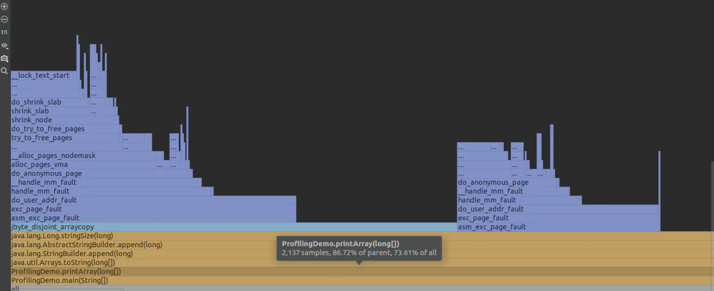
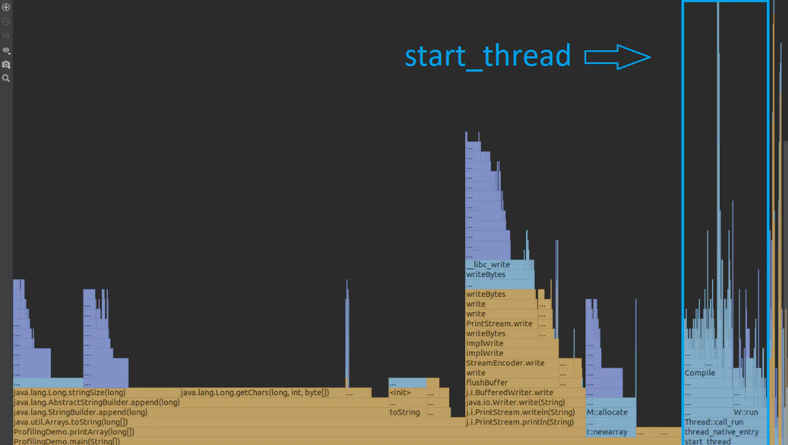
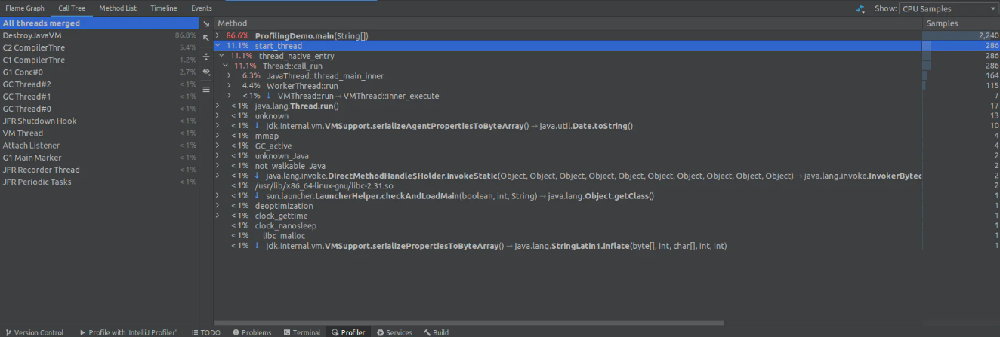
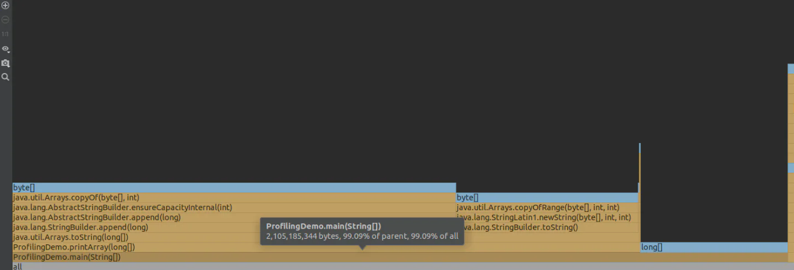

# Profiling

- Profiling techniques -
    - **Measuring method execution time** - using `System.nanoTime()` or `System.currentTimeMillis()`.
    - **Thread dump sampling** - 
        - monitors the threads' states within a process.
        - obtained using the `jstack` command-line utility.
        - provides the information regarding deadlocks, CPU consumption spikes, etc. 
        - can be useful if your application unexpectedly slows down or freezes.
    - **Memory sampling** -
        - shows the details of heap memory by using sampling i.e. creates various samples and analyzing the application execution based on collected data.
        - obtained using the `jmap` command-line utility.
        - `jmap -histo:live <pid>` command shows the histogram of live Java objects.
    - **Bytecode manipulation** -
        - Profiling applications use this technique to modify the application bytecode which allows to collect statistics about it or perform any other manipulations.
        - You can do the same using _Java agents_ services and have your solutions match your individual needs.
    
## Using Intellij Async Profiler

- To profile the application, click on the application launch button > `Profile method() with Intellij Profiler`.
- Performs two types of profiling -
    - CPU profiling
    - Memory allocation

### CPU Profiler

- Click on `Profiler` tab at the bottom after launching the profiler. It will open up a _flame graph_ showing methods called during the application execution and it is based on a stack trace logic.

- Each block represents a single stack frame -
    - Yellow blocks are frames of Java code - written by us or Java base classes.
    - Blue blocks are native method calls.
    - Purple blocks are calls to core Linux kernel methods.

- On the left side of the graph, you will see the threads of the virtual machine itself. You can select a specific one and see the flame graph associated with a specific thread.

- The methods are sorted by their execution time (from left to right). The length of each block depends on this indicator.

> [!NOTE]
> Short blue and purple blocks on the left even if there are longer blocks on the right - these are all the method calls located in the `main()` method hierarchy.

- Analysis - 
    - 86.72% of time consumed by the parent `main()` method.
    - much more CPU time was spent on the execution of the `printArray()` method.
    - `toString()` method is responsible for most of the time spent on the `main()` method.
    - If we study all the yellow blocks in this chain to the end, we will understand that the two methods `stringSize()` and `getChars()` consume nearly half the time spent by the `main()` method.

- Thread analysis -

    

    - In parallel with the `main()` method, other methods were executed. Most of the CPU time among them was spent on the native `start_thread()`, so it is shown immediately after the `main()` method.
    - You can see the overall picture if you right-click the `start_thread` block and click `Focus` on method in _Call Tree_.

    

## Memory Allocation

- Click on `Show: CPU Samples` which will open the drop-down menu and select `Memory Allocations`.

- Its main purpose is to show statistics regarding memory usage by each method.
- Tells us how many bytes the method consumed as well as the same data relative to the parent method and the whole application.

- Analysis -
    - `printArray()` hierarchy consumed the most memory among other method invocations from the `main()` method as it was in the case of CPU time consumption.
    - However, here the main memory consumer is the `copyOf()` method which is responsible for the consumption of more than half the memory consumed by the `main()` method.
