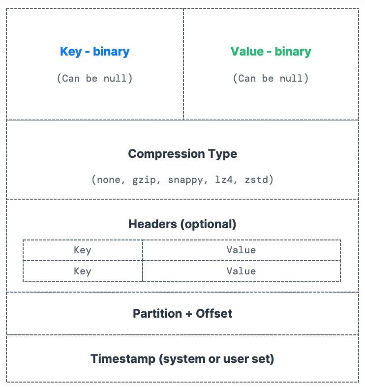
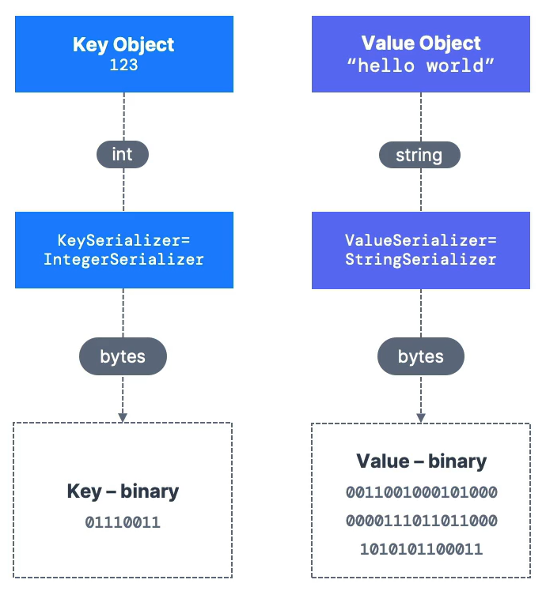
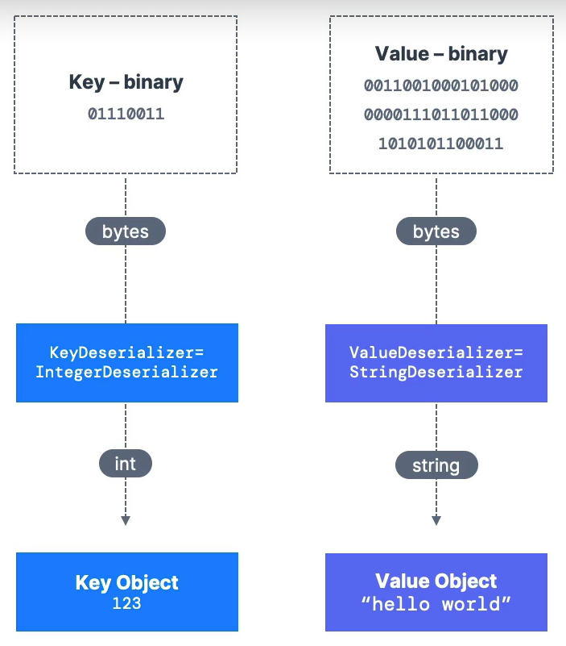
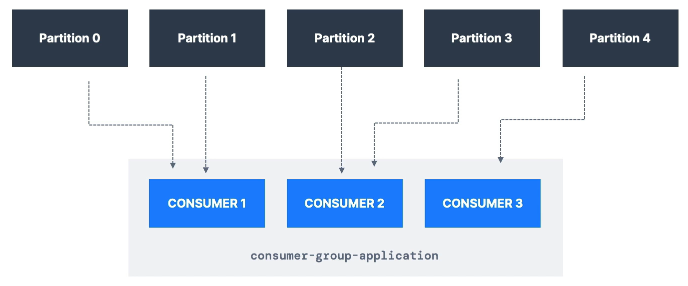
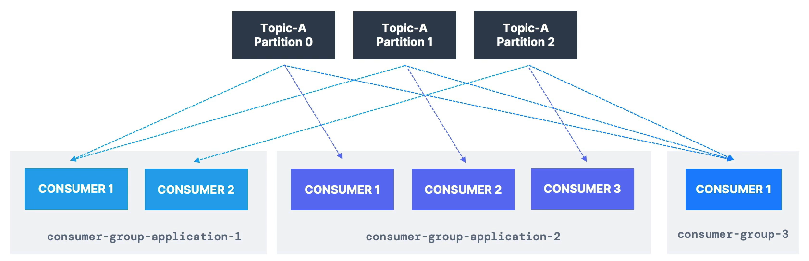
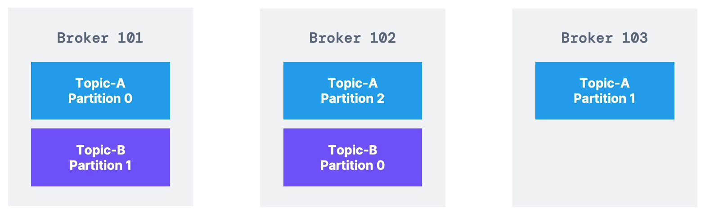
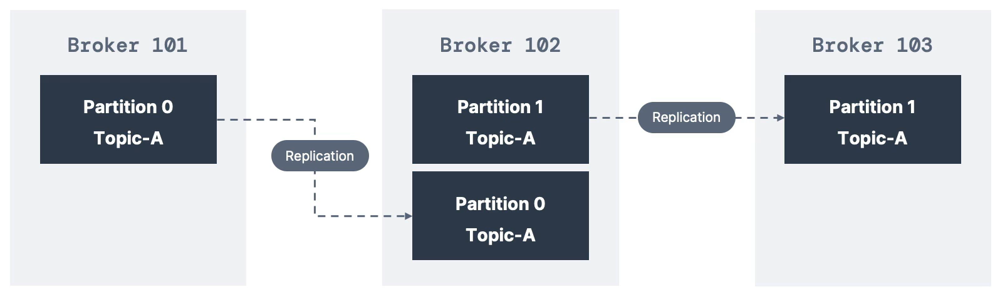
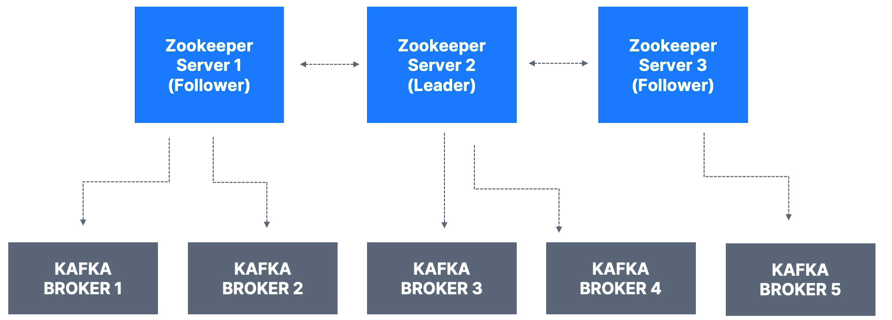

# Kafka

- Created by LinkedIn, now Open source project mainly maintained by Confluent, IBM, Cloudera.
- Benefits -
  - Distributed, resilient architecture, fault tolerant
  - Horizontal scalability - 
    - can scale to 100s of brokers
    - can scale to millions of messages per second
  - High performance (latency < 10ms) - real time

- Use cases -
  - Messaging system
  - Activity tracking
  - Gather metrics from many different locations
  - Application logs gathering
  - Stream processing (with Kafka Streams API)
  - De-coupling of system dependencies
  - Integration with Spark, Flink, Storm, Hadoop etc.
  - Microservices pub/sub

- __Topics__ - 
  - A particular stream of data.
  - You can have as many topics as you want.
  - A topic is identified by its name.
  - Supports any kind of message format such as json, avro, text file, binary etc.
  - The sequence of messages is called a data stream.
  - You cannot query topics, instead, use Kafka Producers and Consumers to send and read the data respectively.

- __Partitions__ -
  - Topics are split in partitions.
  - You can have as many partitions per topic as you want.
  - Messages within each partition are ordered.
  - Message order is guranteed only within a partition, not across partitions.
  - Data is assigned randomly to a partition unless a key is provided.
  - Each message within a partition gets an incremental id called _offset_.
  - Offsets are not re-used even if previous messages have been deleted.

> [!TIP]
> Kafka topics are immutable - once data is written to a partition, it cannot be changed.

> [!TIP]
> Data in Kafka is kept only for a limited time. Default is 1 week, but is configurable.

## Kafka Producer

- Producers write data to topics (which are made of partitions).
- Producers know to which partition to write to and which Kafka broker has it.
- In case of Kafka broker failures, Producers will automatically recover as the load is balanced to many brokers.

- __Message Keys__ -
  - Producers can choose to send a key with the message (string, number, binary etc).
  - If key == `null`, data is sent to partitions in round robin i.e partition0, then 1, then 2 and so on.
  - If key != `null`, then all the messages for that key will always go to the same partition (using hashing).
  - A key is typically sent, if you need message ordering for a specific field.

- __Kafka Message Anatomy__ -



- __Message Serializer__ -
  - Kafka only accepts bytes as an input from producers and sends bytes out as an output to consumers.
  - Message serialization means transforming objects/data into bytes - used on the key and the value.
  - Kafka producers come with common serializers - String (including JSON), Int, Float, Avro, Protobuf etc.



- __Message Key Hashing__ -
  - A Kafka partitioner is a code logic that takes a record and determines to which partition to send it to.
  - _Key Hashing_ is the process of determining the mapping of a key to a partition.
  - In the default Kafka partitioner, the keys are hashed using _murmur2 algorithm_ -
  ```
  targetPartition = Math.abs(Utils.murmur2(keyBytes)) % (numPartitions - 1)
  ```

## Kafka Consumer

- Consumers read data from a topic (identified by name) - _pull_ mechanism.
- Consumers automatically know which broker to read from.
- In case of broker failures, consumers know how to recover.
- Data is read in order from low to high offset within each partition.

- __Consumer Deserializer__ - 
  - Deserializer indicates how to transform bytes into objects/data.
  - Used on the key and the value of message.
  - Common deserializers - String (including JSON), Int, Float, Avro, Protobuf etc.



> [!NOTE]
> The serialization/deserialization type must not change during a topic lifecycle - create a new topic instead.

## Consumer Groups

- All the consumers in an application read data as a consumer groups.
- Each consumer within a group reads from exclusive partitions -



> [!NOTE]
> If you have more consumers than partitions then some consumers will be inactive (which can be used as standby).

- Within a consumer group, only consumer is assigned to one partition.
- It is acceptable to have multiple consumer groups on the same topic, for eg - multiple services might need to read the same data for different use-cases.



- To create distinct consumer groups - use the consumer property `group.id`.

- __Consumer Offsets__ -
  - Kafka stores the offsets at which a consumer group has been reading.
  - The offsets committed are in Kafka topic name `__consumer_offsets`.
  - When a consumer in a group has processed data received from Kafka, it should be _periodically_ committing the offsets (the Kafka broker will write to `__consumer_offsets`, not the group itself).
  - If a consumer dies, it will be able to read back from where it left off - thanks to the committed consumer offsets.

## Delivery Semantics for Consumers

- By default, Java Consumers will automatically commit offsets (at least once).
- Three delivery semantics choices when committing manually -
  - __At least once__ (usually preferred) -
    - Offsets are committed after the message is processed.
    - If the processing goes wrong, the message will be read again.
    - This can result in duplicate processing of messages, so make sure your processing is idempotent.
  - __At most once__ -
    - Offsets are committed as soon as messages are received.
    - If the processing goes wrong, some messages will be lost.
  - __Exactly once__ -
    - For Kafka-to-Kafka workflows - use the Transactional API (easy with Kafka Streams API).
    - For Kafka-to-External System workflows - use an idempotent consumer.

## Kafka Brokers

- A Kafka Cluster is composed of multiple brokers (servers).
- Each broker is identified with its integer ID.
- Each broker knows about all brokers, topics and partitions (metadata).
- Each broker contains certain topic partitions.
- After connecting to any broker (called a _bootstrap broker_), you will be connected to the entire cluster (Kafka clients have smart mechanics for that).
- A good number to get started is 3 brokers, but big clusters can have over 100 brokers.
- Horizontal scaling with Brokers and topics -
  - Example - Topic A has 3 partitions and Topic B has 2 partitions -

  

  - Note - data is distributed, and Broker 103 doesn't have any Topic B data.
  - The more partitions and more brokers we add, more the data will be spread out across our entire cluster.

- __Kafka Broker Discovery__ -
  - Each Kafka broker is also called a _bootstrap server_ - means you only need to connect to one broker, and the Kafka clients will know how to be connected to the entire cluster.
  - Kafka client initiates a connection + metadata request.
  - Bootstrap server returns the list of all brokers and other information such as which broker has which partition.
  - Kafka client can then connect to the broker it needs.

## Topic Replication Factor

- Topics should have a replication factor > 1 (usually between 2 and 3), most commonly 3.
- This way if a broker is down, another broker can server the data.
- Example - Topic A with 2 partitions and replication factor of 2 -



- If we lose Broker 102, then Broker 101 and 103 can still server the data.

## Leader for a Partition

- At any time, only ONE broker can be a leader for a given partition.
- Producers can only write to the leader broker for a partition.
- The other brokers will replicate the data.
- If the data is replicated fast enough, then each replica is going to be called _in-sync replica (ISR)_, otherwise out-of-sync replicas.
- Consumers will read from the leader of a partiton by default. 
  - In older versions, it could _only_ read from the leader.
  - In Kafka 2.4+, it is possible to configure consumers to read from the closest replica -
    - to improve latency
    - decrease network cost
  
## Producer Acknowledgements (acks)

- Producers can choose to receive acknowledgment of data writes -
  - `acks=0` - producer won't wait for acknowledgement (possible data loss).
  - `acks=1` - producer will wait for leader acknowledgment (limited data loss).
  - `acks=all` - Leader + replicas acknowledgement (no data loss).

> [!TIP]
> Kafka topic durability - for a replication factor of `N`, you can permanently lose upto `N-1` brokers and still recover your data.

## Zookeeper

- Zookeeper manages brokers (keeps a list of them).
- Helps in performing leader election for partitions.
- Sends notifications to Kafka in case of changes (eg - new topic, broker dies, broker comes up, delete topics etc).
- Kafka 2.x can't work without Zookeeper.
- Kafka 3.x can work without Zookeeper (KIP-500) - using Kafka Raft (or KRaft in short) instead.
- Kafka 4.x will not have Zookeeper.
- Zookeeper by design operates with an odd number of servers (1, 3, 5, 7).
- Has a leader (writes) and the rest of the servers are followers (reads).

> [!NOTE]
> Zookeeper does not store consumer offsets with Kafka > 0.10.

- __Zookeeper Cluster (ensemble)__ -



## KRaft 

- Zookeeper shows scaling issues when Kafka clusters have > 100,000 partitions.
- By removing Zookeeper, Kafka can - 
  - Scale to millions of partitions, and become easier to maintain and setup.
  - Improve stability, makes it easier to monitor, support and administer.
  - Single security model for the whole system.
  - Single process to start with Kafka.
  - Faster controller shutdown and recovery time.

- Kafka 3.x now implements the Raft protocol (KRaft) in order to replace Zookeeper - 
  - Production ready since Kafka v3.3.1 (KIP-833).
  - Kafka 4.0 will be released only with KRaft (no Zookeeper).

- KRaft Performance Improvements -


