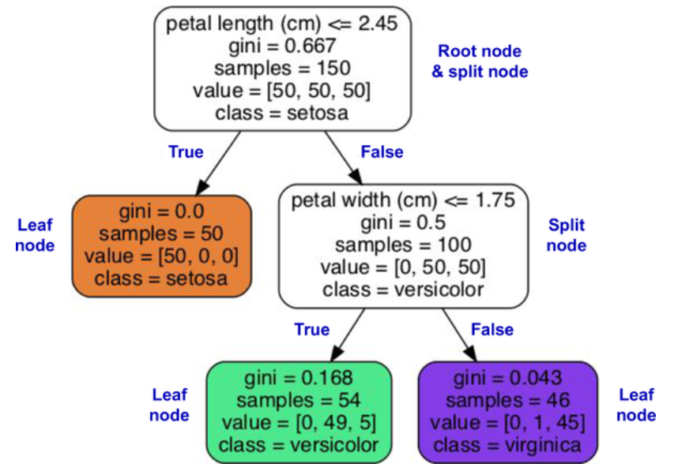
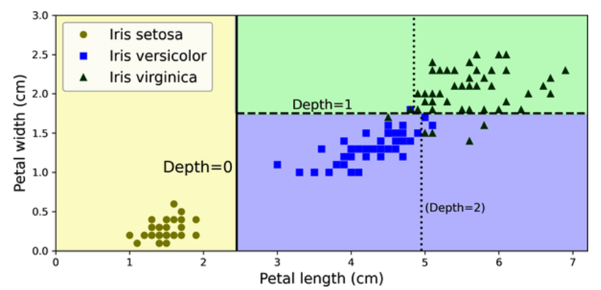

# Decision Trees

- Decision trees can perform both classification and regression tasks, and even multioutput tasks.
- capable of fitting complex datasets.
- require very little data preparation. In fact, they don’t require feature scaling or centering at all.

### Gini Impurity

- Gini impurity $(G)$ of a node is calculated as -
    
    $G = 1 - \sum_{k=1}^{n} p_k^2$

    where $p_i$ is the ratio of class $k$ instances among the training instances in the node.

## Classifier Implementation

```
from sklearn.datasets import load_iris
from sklearn.tree import DecisionTreeClassifier

iris = load_iris(as_frame=True)
X_iris = iris.data[["petal length (cm)", "petal width (cm)"]].values
y_iris = iris.target

tree_clf = DecisionTreeClassifier(max_depth=2, random_state=42)
tree_clf.fit(X_iris, y_iris)
```

- To visualize the trained decision tree, we use `export_graphviz()` function to output a graph definition file called `iris_tree.dot` -
```
from sklearn.tree import export_graphviz

export_graphviz(
        tree_clf,
        out_file="iris_tree.dot",
        feature_names=["petal length (cm)", "petal width (cm)"],
        class_names=iris.target_names,
        rounded=True,
        filled=True
    )
```

- Use `graphviz.Source.from_file()` function to load the file and display -
```
from graphviz import Source

Source.from_file("iris_tree.dot")
```

> [!TIP]
> Graphviz is an open source graph visualization software package. It also includes a dot command-line tool to convert `.dot` files to a variety of formats, such as PDF or PNG.

- Iris Decision Tree -

  

- where -
    - `sample` = #training instances for which the node is applicable, eg - 100 training instances have a petal length greater than 2.45 cm (depth 1, right).
    - `value` = how many training instances of each class this node applies to, eg - the bottom-right node applies to 0 Iris setosa, 1 Iris versicolor, and 45 Iris virginica.
    - `gini` = measures Gini impurity. For eg - Gini impurity of depth-2 left node = $1 – (0/54)^2 – (49/54)^2 – (5/54)^2 ≈ 0.168$ 

> [!NOTE]
> Scikit-Learn uses the _CART_ algorithm, which produces only binary trees. However, other algorithms, such as _ID3_, can produce decision trees with nodes that have more than two children.
    
### Decision Tree Boundaries

- // TODO - Implementation -

    

-  The thick vertical line represents the decision boundary of the root node (depth 0) i.e. petal length = 2.45 cm.
- Since the lefthand area is pure (only Iris setosa), it cannot be split any further.
- However, the righthand area is impure, so the depth-1 right node splits it at petal width = 1.75 cm (represented by the dashed line).
- Since max_depth was set to 2, the decision tree stops right there. If you set max_depth to 3, then the two depth-2 nodes would each add another decision boundary (represented by the two vertical dotted lines).

