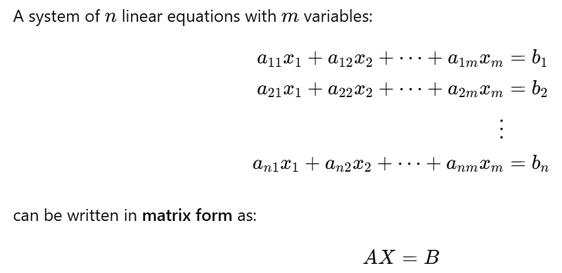
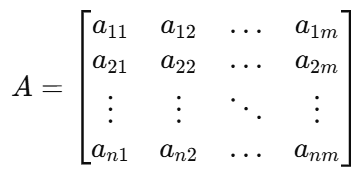
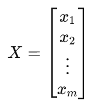
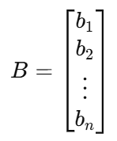

# Linear Algebra

- When formalizing intuitive concepts, a common approach is to construct a set of objects (symbols) and a set of rules to manipulate these objects. This is known as an **algebra**.
- **Linear algebra** is the study of _vectors_ and certain algebra _rules_ to manipulate vectors.
- Any object that satisfies these two properties can be considered a _vector_ (written in bold letters) - 
    - can be added together.
    - can be multiplied by scalars to produce another object of the same kind.

- Example -
    - Geometric vectors are directed segments -
        - Two geometric vectors **x** & **y** can be added to create another geometric vector - **x** + **y** = **z**
        - Multiplication by scalar also creates another geometric vector - λ **x**, λ ∈ ℝ

    - Polynomials -
        - Two polynomials can be added together, which results in another polynomial.
        - Can be multiplied by a scalar λ ∈ ℝ, and the result is a polynomial.

    - Audio signals -
        - Audio signals are represented as a series of numbers. We can add audio signals together, and their sum is a new audio signal. 
        - If we scale an audio signal, we also obtain an audio signal.

    - Elements of ℝn (tuples of `n` real numbers) -
        - Adding two vectors **a**, **b** ∈ ℝn component-wise results in another vector - **a** + **b** = **c** ∈ ℝn
        - Multiplying **a** ∈ ℝn by λ ∈ ℝ results in a scaled vector λ**a** ∈ ℝn

## Systems of Linear Equations

- A system of linear equations is a set of two or more linear equations involving the same set of variables. The goal is to find the values of the variables that satisfy all the equations simultaneously.

- General form -

    a11x1 + a12x2 + ... + a1mxm = b1

    a21x1 + a22x2 + ... + a2mxm = b2

    ...

    an1x1 + an2x2 + ... + anmxm = bn

    where -
    - x1, x2, ... , xm are the unknown variables
    - aij are the coefficients
    - bi are the constants

- Types of Solutions -
    - **Unique Solution** – One set of values satisfies all equations.
    - **No Solution** – The equations represent parallel lines (inconsistent system).
    - **Infinite Solutions** – The equations represent the same line or plane (dependent system).

## Matrices

- A system of linear equations can be compactly represented using matrices -

    

    where -
    - **Coefficient Matrx _A_** (size _n_ x _m_) -

        

    - **Variable Matrix _X_** (size _m_ x _1_) -

        

    - **Constant Matrix _B_** (size _n_ x _1_) -

        

- **Matrix Addition** - The sum of two matrices **_A_** ∈ ℝ_m x n_, **_B_** ∈ ℝ_m x n_ is computed by the _element-wise_ sum.
- **Matrix Multiplication** / **Dot Product** - The multiplication of two matrices **_A_** ∈ ℝ_m x n_, **_B_** ∈ ℝ_m x n_ is computed as **_C_** = **_A_ _B_** ∈ ℝ_n_ x _k_  where we multiply the elements of _i_ th row of **_A_** with _j_ th column of **_B_** and sum them up.

> ![NOTE]
> Matrices can only be multiplied if their “neighboring” dimensions match i.e. _A n x k_ . _B k x m_ = _A n x m_
> Therefore, matrix multiplication is not commutative - **_A . B_** != **_B . A_**

- ** Identity Matrix** - **_1_**s on the principal diagonal and **_0_**s everywhere else.
