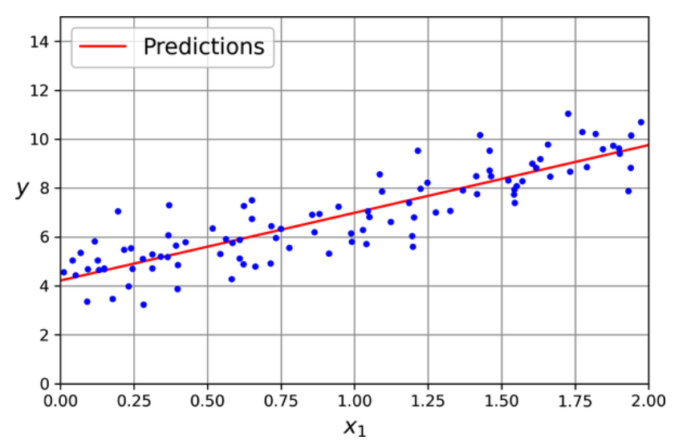

# Linear Regression

- Linear Model = Weighted sum of input features + Bias (also called intercept).

  $\hat{y} = \theta_0 + \theta_1 x_1 + \theta_2 x_2 + \dots + \theta_n x_n$

  where -
  - $\hat{y}$ is the predicted value
  - $n$ is the number of features
  - $x_i$ is the $i^{th}$ feature
  - $\theta_j$ is the $j^{th}$ model parameter, including the bias term $\theta_0$ and the feature weights $\theta_1, \theta_2, \dots, \theta_n$

- Vectorized form -

  $\hat{y} = h_{\theta}(x) = \theta^T X$

  where -
  - $h_{\theta}$ is the hypothesis function, using the model parameter $\theta$
  - $\theta$ is the model's parameter vector, containing the bias term $\theta_0$ and the feature weights $\theta_1, \theta_2, \dots, \theta_n$
  - $X$ is the instance’s feature vector, containing $x_0$ to $x_n$, with $x_0$ always equal to $1$
  - $\theta \cdot X$ is the dot product of the vectors $\theta$ and $X$, which is equal to $\theta_0 x_0 + \theta_1 x_1 + \theta_2 x_2 + \dots + \theta_n x_n$
  - Vectors are often represented as column vectors, therefore, we transpose the $\theta$ vector

> [!NOTE]
> Learning algorithms will often optimize a different loss function during training than the performance measure used to evaluate the final model. We choose the training loss function that is easy to optimize (e.g., log loss), and performance metrics that are closer to business needs (e.g., precision/recall). However, a training loss is strongly correlated to the metric.

- Root Mean Square Error (RMSE) is the most common performance measure of a regression model, therefore we need to find the value of $\theta$ that minimizes the RMSE.

  $MSE = \frac{1}{n} \sum (y_i - \hat{y}_i)^2$

- Minimizing the cost function using _Normal equation_ -

  $\hat{\theta} = (X^T X)^{-1} X^T y$

  where -
  - $\hat{\theta}$ is the value of $\theta$ that minimizes the cost function
  - $X$ is the feature matrix, where each row is a training instance and the first column is typically filled with 1s (for the bias term)
  - $y$ is the vector of target values from the dataset

- Normal Equation Derivation -
  - MSE cost function -

    $MSE = \frac{1}{n} \sum (y_i - \hat{y}_i)^2$

  - Writing it in vector form -

    $MSE = \frac{1}{n} (y - \hat{y})^T (y - \hat{y})$

  - Substituting $\hat{y} = X\theta$ -
    
    $MSE = \frac{1}{n} (y - X \theta)^T (y - X \theta)$

  - Expanding the equation - 

    $MSE = \frac{1}{n} \left[ y^T y - 2 \theta^T X^T y + \theta^T X^T X \theta \right]$

  - To minimize the MSE, take the derivative of $MSE$ w.r.t. $\theta$ and set it equal to 0 -

    $\frac{\partial}{\partial \theta} \left( \frac{1}{n} \left[ y^T y - 2 \theta^T X^T y + \theta^T X^T X \theta \right] \right)$

  - Since $y^T y$ does not depend on $\theta$, its derivative is zero -

    $\frac{\partial MSE}{\partial \theta} = \frac{1}{n} \left[ -2 X^T y + 2 X^T X \theta \right]$

  - Set the Derivative Equal to 0 -

    $-2 X^T y + 2 X^T X \theta = 0$

  - Simplifing -

    $X^T X \theta = X^T y$

  - Assuming $X^T X \theta$ is invertible, we can solve for $\theta$ and therefore the normal equation is -

    $\hat{\theta} = (X^T X)^{-1} X^T y$

## Implementation

- Generate some linear-looking data, eg - $y = 4 + 3x_1 + Gaussian noise$
  ```
  import numpy as np

  np.random.seed(42)                      # code reproducibility
  m = 100                                 # number of instances
  X = 2 * np.random.rand(m, 1)            # training set - column vector
  y = 4 + 3 * X + np.random.randn(m, 1)   # predictions for training set - column vector
  ```

- Adding dummy feature -
  ```
  from sklearn.preprocessing add_dummy_feature

  X_b = add_dummy_feature(X)              # add x0 = 1 to each instance
  ```

- Calculating $\hat{\theta} = (X^T X)^{-1} X^T y$ -
  ```
  theta_best = np.linalg.inv(X_b.T @ X_b) @ X_b.T @ y
  ```

> [!TIP]
> `@` operator performs matrix multiplication ie. if `A` and `B` are NumPy arrays, then `A @ B` is equivalent to `np.matmul(A, B)`.

- `theta_best` will generate values - `array([[4.21509616], [2.77011339]])` i.e. $\theta_0 = 4.215$ and $\theta_1 = 2.770$ instead of $\theta_0 = 4$ and $\theta_1 = 3$ because the noise made it impossible to recover the exact parameters of the original function.

- Making predictions -
  ```
  X_new = np.array([[0], [2]])
  X_new_b = add_dummy_feature(X_new)
  y_pred = X_new_b @ theta_best
  ```

- Plotting model's predictions -
  ```
  import matplotlib.pyplot as plt

  plt.plot(X_new, y_predict, "r-", label="Predictions")
  plt.plot(X, y, "b.")
  plt.show()
  ```

  

  