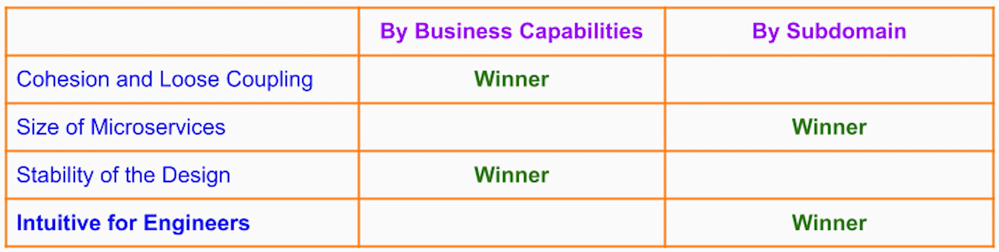
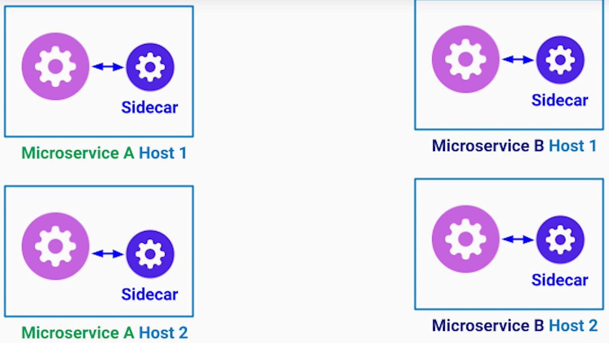
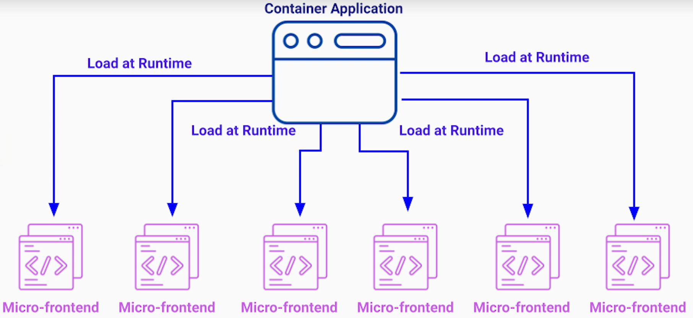
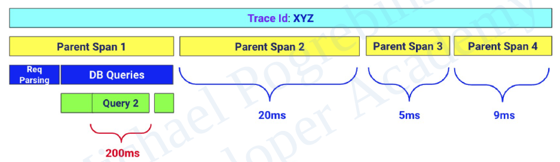

# Microservices

- __Monolithic Architecture__ -
  - 3-Tiers -
    - Presentation Tier - mobile app, tablet app, webpage.
    - Logic/Business/Application Tier - web application
    - Data Tier - databases, file systems.
  - Benefits -
    - Easy to design.
    - Easy to implement.
  - Perfect for -
    - small teams.
    - startup companies.
  - Issues -
    - Low organizational scalability.
    - Low system scalability.

> [!TIP]
> __2 Pizaa rule__ - A team should be small enough that it can be fed with 2 pizzas.

- __Microservices Architecture__ -
  - Organizes our business logic as loosely coupled and independently deployed collection of services.
  - Each service is owned by a small team and has narrow scope of responsibilities.
  - Benefits -
    - Higher organizational scalability - much smaller codebase, faster build times, easier engineers onboarding.
    - Higher system scalability - a bug in one microservice will impact only that microservice and dependent microservices at some level, but rest of the microservices remain stable.
  - Issues -
    - Complexity of running a distributed system - unpredictable behavior, success, performance.
    - Harder to test - need complex integration tests.
    - Harder to troubleshoot and debugging - not sure which microservice(s) introduce performance issues or the bug.
    - Risk of decreased organization scalability - if microservices boundaries are set incorrectly then we will more organizational overhead than benefits, eg - every change in the system needs coordination between different teams.

- __Core Principles for successful microservices architecture__ -
  - Cohesion - elements that are tightly related to each other and change together should stay together.
  - Single Reponsibility Principle - each microservices should do only one thing exceptionally well.
  - Loose coupling - little or no interdependencies between services.

## Issues migrating Monolith to Microservices

- __Splitting by Application Layers__ -
  - Layers -
    - Front layer - handles user requests, security, permissions validations, and can serve html & css to the web browsers.
    - Business logic layer - handles product, recommendations, reviews, checkouts, discounts, users, accounts etc.
    - Data persistence & Payment processing layer.
  - Pros -
    - Takes advantages of existing logical layers.
    - No major refracting is required.
  - Cons -
    - Every new feature will require change in all the microservices - API change (front layer), business logic change and data change.
    - Therefore, microservices are not cohesive enough.

- __Splitting by Technology Boundaries__ -
  - Uses different tech stack based on the performance needs, eg -
    - Front layer in node.js.
    - Product recommendations in C++.
    - Another product recommendations in Python with ML.
    - Payment processing service in Golang.
  - Cons -
    - Stakeholders don't know which subteam/service gets the incoming task.
    - Violates single responsibility principle.
  
- __Splitting for minimum size__ -
  - Assumption - splitting into tiny services would give us the best benefits.
  - Every module/package/class into single microservice.
  - Cons -
    - Tight coupling - requires a lot of network communication.
    - Almost impossible troubleshooting.
  
## Decomposing Monolith to Microservices

- __Decomposition by Business Capabilities__ -
  - Define microservices by core capabilities that provide values to business and customers.
  - Identifying business capabilities -
    - Run a thought experiment - Describe the system to a non-technical person.
    - Example - online store -
      - _Browse_ through products - Web App Service.
      - Search/view for _products_ - Products Service.
      - Read the _reviews_ - Reviews Service.
      - Place _orders_ - Orders Service.
      - _Shipping_ of the product - Shipping Service.
      - Maintain product _inventory_ - Inventory Service.

- __Decomposition by Domain/Subdomain__ -
  - Define microservices by developer point of view.
  - More intuitive.
  - Each subdomain defines _sphere of knowledge, influence or activity_.
  - Subdomains can be of three types -
    - Core -
      - Key differentiator.
      - Cannot be outsourced.
      - Without it, our business doesn't provide value.
    - Supporting -
      - Integral in delivering the core capabilities.
      - Is not (necessarily) different from our competitors.
    - Generic -
      - Not specific to any business.
      - Can be outsourced.
  - Subdomain categorization helps -
    - Prioritize the investment into each subdomain.
    - Allocate engineers by experience.
    - Save costs/time using off-the-shelf solutions.
  - Example - online store -
    - Core -
      - Products catalog - products in our business will be different from the competitors.
    - Supporting - without them, we cannot sell products but they can be similar in functionality to other businesses.
      - Orders
      - Inventory
      - Shipping
    - Generic - essential, but very generic.
      - Reviews
      - Payments
      - Search
      - Images
      - Image compression
      - Security
      - Web UI
  - Each subdomain or group of multiple ones (such as image and image compression) can now be a single microservice.

- Other methods -
  - Decomposition by Action.
  - Decomposition by Entities.

## Executing decomposition

- __Big Bang Approach__ -
  - Map out the microservices boundaries.
  - Entire team focuses on the migration and stops any development of new features.
  - Cons - 
    - Worse approach in terms of the productivity and business impact - "Too many cooks in the kitchen".
    - Hard to estimate the effort for large and ambiguous projects.
    - Stopping development is detrimental to the business.

- __Incremental and Continuous Approach__ -
  - Identify the components that can benefit the most from the migration.
  - Best candidates -
    - Areas with most development/frequent changes.
    - Components with high scalability requirements.
    - Components with the least technical debt.
  - Benefits -
    - No hard deadlines necessary.
    - Consistent, visible and measurable progress.
    - Business is not disrupted.
    - Exceeding the time estimates is not a problem.

## Steps to Prepare of Migration

- Add/ensure code test coverage.
- Define component API.
- Isolate the component by removing interdependencies to the rest of the application.

## Strangler Fig Pattern

- Introduce a proxy, called __Strangler Facade__, in front of the monolithic application. 
  - It simple allows requests to passthrough. 
  - Typically implemented using an API Gateway.
- Once the new microservice is deployed and tested, we reroute the requests for it from the monolithic application to the new microservice.
- After monitoring the new microservice, we can now remove the old component from the monolith.
- Repeat until all the microservices are moved.

> [!TIP]
> While migrating, keep the code and technology stack unchanged.

## Database per Microservice Principle

- Each microservice fully owns its data and does not expose it directly to any other service.
- Whenever a microservice requires data from another microservice, it sends a network request to the target service API.
- Pros -
  - API abstracts database technology used by the target service.
  - If API change is required, it can offer two versions (`v1`, `v2`) of the API for few weeks/months - allowing other teams enough time to make their changes.
- Cons -
  - Added latency - can be minimized with caching some data, but then it can also lead to eventual consistency.
  - Cannot join multiple tables from different services.
  - Loss of transaction gurantees.

## Don't Repeat Yourself (DRY) Principle

- Uses shared libraries.
- Pros -
  - We need to make a change in only one place.
  - Reduce duplicate effort.
  - Work of a single engineer can be reused.
- Cons -
  - Doesn't always apply to micrservices.
  - Tight coupling - when multiple services dependent on a shared libary, any changes to the shared library requires coordination.
  - Bug/vulnerability in a shared library impacts all microservices.
  - _Dependency Hell_ - 
    - A microservice can use library `A` that in turn uses library `B`, and it can also be using library `B` directly. 
    - Now, if newer version of library `A` uses newer version of library `B`, we will have two versions of library `B`.
- Solutions -
  - Reevaluate the boundaries - such that there is no need of a shared library.
  - New microservice - if shared library has complex business logic, we can create it another microservice.
- Suitable for -
  - Common data models for communication.
  - Code generation - eg - Interfaces, gRPC definitions, GraphQL schemas.

- No code duplication options -
  - __Sidecar Pattern__ -
    - Package and deploy the shared functionality as a separate process running on the same host as the microservice instances.
    - Each microservice can communicate with its local sidecar process using standard network protocols (eg - HTTP).
    - Smaller network overhead than a separate service/host, but higher than with code in a shared library.

    

  - __Use a shared library__ -
    - Has to be self contained and independent of other libraries.
    - Should be used as a last resort.

## Micro-frontends

- Splits the web application into -
  - Independent single-page applications.
  - Maintained by separate teams.
  - Assembled by a container application at runtime.

- Role of Container Application -
  - Render common elements.
  - Take care of common functionality.
  - Tell each micro-frontend where/when to be rendered.

- __Best Practises__ -
  - Micro-frontends should be loaded at runtime. 
    - Otherwise, it would be similar to having a multi-module project.
  - No shared state in the browser.
    - Otherwise, it would be similar to having same database across different microservices.
  - Intercommunication through -
    - Custom events
    - Callbacks

## API Gateway Pattern

- Places an API Gateway Service as entrypoint to our system.
- Reroutes incoming requests to relevant microservices.
- Allows faning out the incoming requests to multiple services and aggregating the results before sending it back to the client.
- Features -
  - Throttling
  - Monitoring
  - Authorization and TLS termination
  - API versioning and management
  - Protocol/Data translation

## Load Balancers

- A load balancer is placed before every microservice that reroutes incoming requests to a particular instance of that microservice according to manage the load.
- Features -
  - Little performance overhead
  - Health checks
  - Different routing algorithms

## Testing Microservices

- Testing pyramid of Monolithic application -
  - Functional/End-to-end Tests
  - Integration tests
  - Unit tests

- In microservices architecture -
  - We have testing pyramid for each microservice.
  - Microservices Integration Tests - 
    - We treat each microservice as a small unit that is part of the larger system and put it in the larger testing pyramid.
    - This ensures that every pair of microservices works fine with each other while mocking the rest of the system.
  - Finally add end-to-end testing for the whole system.

- Challenges -
  - High costs and complexity of end-to-end tests.
  - Tight coupling of integration tests.
  - Complexity and overhead of testing event-driven microservices.

- Solution - Integration Tests using Mocks -
  - Drawbacks -
    - The contract between the API consumer and API provider can get out of sync. But since the mock implementation doesn't change, the tests may pass but the system may fail in production.

## Contract Tests

- Use a dedicated tool to keep the mock API provider and API consumer in sync through a shared contract.
- During these tests, we verify if the microservice `A` sends the right requests to microservice `B`, and gets back the right responses as expected.
- Additionally, each request is sends to the mock API provider is recorded along with the expected response into a contract file.
- This contract file is then shared with the team that owns microservice `B`.
- Using this contract, microservice `B` replays all those recorded requests to their real microservice `B` and verifies that the responses it gets are same as recorded in the contract.
- Benefits -
  - Each team can run their own integration tests.
  - Can be used in event-driven architecture using mock message broker with each service and then recording the requests/response in the contract.
- Drawbacks - not suitable for end-to-end testing.

## End-to-End Tests Alternatives

- Testing in production.
- Blue-Green deployment + Canary testing
  - Blue-Green deployment is a safe way to release a new microservice version using two identical production environments without any downtime during the release.
  - Blue environment is a set of servers that run older version, and green environment runs newer version.
  - Once the newer version is released on green environment, we can run our end-to-end tests on it since no traffic is going to it.
  - After running the tests, we can ship a portion of the production traffic to the green environment and monitor it for performance and functional issues.
  - This process is called _canary testing_ - 
    - If we detect any issues, we immediately redirect traffic from green to blue environment.
    - otherwise, we redirect all the production traffic from blue to green environment and gradually decommission the blue environment.

## Observability

- Monitoring is the process of collecting, analyzing and displaying _predefined_ set of metrics -
  - allows us to find out if something is wrong.
  - but doesn't tell us what is wrong and how to remediate the problem.

- Observability enables us to debug, search for patterns, follow input/outputs and gain insights into the behavior of the system -
  - allows us to follow individual requests, transactions, events.
  - discover and isolate performance bottlenecks.
  - and ultimately, point us to the source of the problem.

- Three pillars of observability -
  - Distributed logging
  - Metrics
  - Distributed tracing

## Distributed Logging 

- Simple way to provide insights into the application's state.
- Best practises -
  - Centralized Logging System
  - Predefined structure/schema
  - Log Level / Log Severity
  - Corelation Id
  - Adding Contextual Information

## Metrics

- Measurable or countable signals of software that help us monitor the system's health and performance.
- Five Golden Signals/Metrics -
  - Traffic - 
    - Amount of demand being placed on our system per unit of time.
    - Examples -
      - HTTP requests/sec by the microservice
      - Queries and transactions/sec by the database
      - Events received and delivered/sec by the message broker
      - Incoming requests and outgoing requests/sec
  - Errors -
    - Error rate and error types.
    - Examples -
      - Number of application exceptions
      - HTTP response status codes (4XX, 5XX)
      - Response exceeding latency thresholds
      - Failed events
      - Failed delivery by the message broker
      - Aborted transactions
      - Disk failures etc
  - Latency - 
    - Time it takes a service to process a request.
    - Important consideration -
      - Consider latency distribution over average.
      - Separate latency of successful operations from failed operations.
  - Saturation -
    - Describes how overloaded/full a service/resource is.
    - Important if the system has any type of queues - if the queue gets full, the consumers have instability issues.
  - Utilization -
    - How busy a resource is over a period of time (0-100%).
    - Examples - CPU, memory and disk space.

## Distributed Tracing

- We generate a unique trace id with the initial request and place it into an object - __Trace Context__ - which contains key data about the entire trace.
- As the request flows through microservices, the context is propagated usually through HTTP headers or message headers inside events.
- As soon as the service instance receives the context, it collects the necessary data and propagates the context to the next service.
- At the end of the transaction, each involved service will have its own measurements which can be later aggregated by trace id.
- To visualize all the parts of the transaction, and how long each part of the transaction took, the trace is broken into logical units of work called __span__.
- Those trace spans can be coarse-grained like processing of a request by the service, or a query by the database, or can be manually created by the developers using instrumentation library.

- Once the trace data is collected inside each service instance, it is pulled by an agent which runs as a separate process on the same host with each service instance.
- Those agents then send that data to central queue or topic in the message broker.
- The data is then analysed, aggregated, indexed and stored in a database by a Trace Data Processor.
