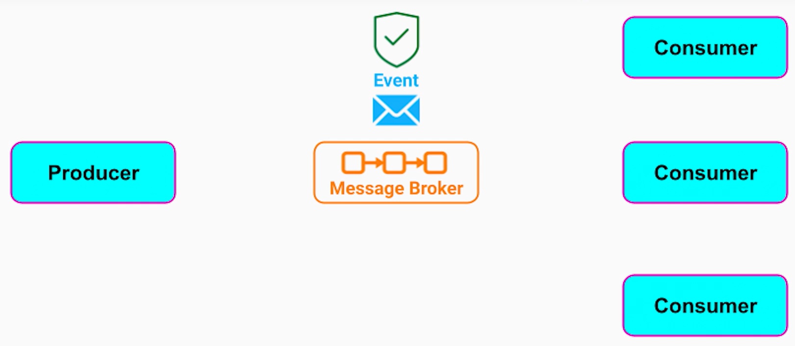
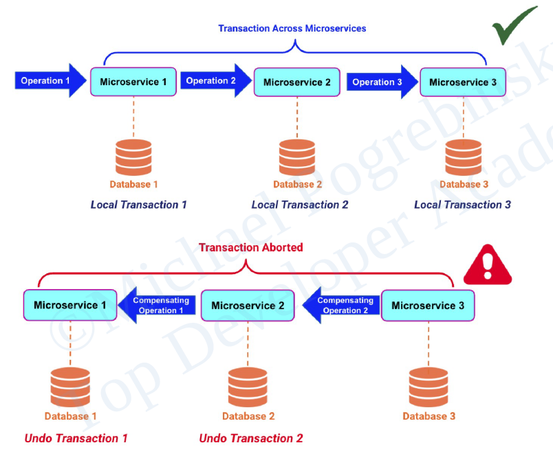
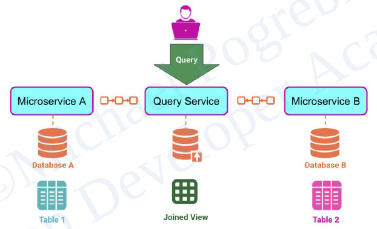
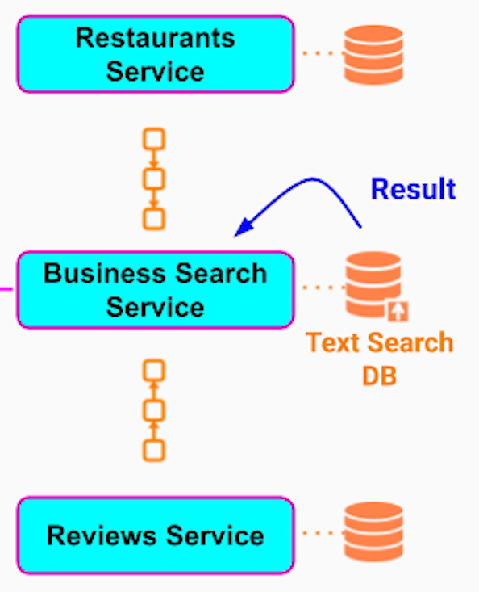

# Event Driven Architecture

- __Event__ - 
  - represents a fact, action or a state change in our system.
  - always immutable.#.
  - can be stored indefinitely.
  - can be consumed multiple times by different services.

- Participants -

- Request-Response vs Event-Driven model -
  - Request-Response -
    - Synchronous communication.
    - Sender needs to be aware of the receiver and know exactly how to call its API.
    - Tight coupling.
  - Event-Driven -
    - Aynchronous communication.
    - Inversion of control - Publish need not to be aware of the consumers of the events.
    - Loose coupling.

- Use cases -
  - __Fire and Forget__ -
    - Sender doesn't expect a response immediately or never at all.
    - Eg - report generation - generates a report and sends it to user's email.
  - __Reliable Delivery__ -
    - Eg - ordering from an online store, money transfer etc.
  - __Infinite stream of events__ -
    - Eg - sensor data stream.
  - __Anomaly detection/pattern recognition__ -
    - Eg - metrics from server.
  - __Broadcasting__ -
    - Eg - digital ad clicks - broadcasts these events to interested services.
  - __Buffering__ -
    - to tolerate traffic spikes in our system.

## Event Delivery Patterns

- __Event Streaming__ -
  - Message broker is used as a temporary / permanent storage for events.
  - Consumers have full access to the logs of those events even if they have already been consumed by the same consumers or by the others.
  - New consumers also have access to older events and can replay them.
  - Provides reliable delivery.
  - Perfect for pattern/anomaly detection.

- __Pub/Sub__ -
  - Consumers subscribe to particular topic or queue and receives events after subscribing.
  - Subscribers don't have access to all the events and as soon as the subscriber receives the events, the message broker will typically delete it from its queue.
  - New subscribers will only receive new events.
  - Ideal when -
    - message broker is used as a temporary storage or broadcasting mechanism.
    - Fire and forget
    - Broadcasting
    - Buffering
    - Infinite stream of events

## Message Delivery Semantics

- __At-Most-Once__ -
  - Producer does not resend the event if it doesn't receive an acknowledgement.
  - Used when data loss is acceptable, but not data duplication.
  - Provides least overhead and lowest latency.

- __At-Least-Once__ -
  - Producer resends the event if it doesn't receive an acknowledgment.
  - Used when data loss is unacceptable and data duplication is okay.
  - Downside - increased latency.

- __Exactly-Once__ -
  - Most difficult to achieve.
  - Highest overhead and latency.
  - Algorithm -
    - On publisher side, before sending an event to the message broker, we need to generate an _idempotency id_ or a unique _sequence number_. Some message brokers can generate it internally, while in other cases, we may need to use a separate service like Sequence Number Generator.
    - The idea is to send the id along with the event.
    - If the producer doesn't receive an acknowledgement, it resends the event with the same id.
    - If the message broker is the one which provided the unique id, it checks if an event with the same id is already present in the logs. If it is, the event will be ignored.
    - On consumer side, the message broker can only gurantee at-least-once semantic. We can handle this case by storing the idetempotency id in our database, so the consumers will know if that event has been processed already.

> [!NOTE]
> __Transaction__ gurantees to an external observer that a sequence of operations appears as a single operation.

## Saga Pattern

- Solves problem - loss of ACID transaction gurantees in microservices architecture.
- Alorithm -
  - We perform the individual operations as a sequence of local transactions in each database.
  - Each successful operation, triggers the next operation in the sequence.
  - If a certain operation fails, we rollback the previous operations by applying _compensating operations_ that have the opposite effect from the original operations.

- Two ways to implement -
  - __Stateful Workflow Orchestration Service__ - 
    - A separate service that orchestrates the workflow and apply compensating operations.
    - For a transaction, we need to define a worfklow order in this service.
    - The operations within a workflow are commonly referred to as _activities_.
  - __Event-Driven Architecture__ -
    - Delegates the management of entire workflow to the microservices themselves.
    - Each microservice needs to know where to send next event if the operation is successful or unsuccessful.

## CQRS Pattern

- CQRS = "Command and Query Responsibility Segregation"
- Two types of operations -
  - __Command__ - 
    - An action that results in a data change.
    - Eg - insertion, updation, deletion.
  - __Query__ - 
    - Only reads data, but doesn't change it.
    - Data can be returned as-is or transformed, however, the data inside the database will never change.
- We separate the code and storage the command part of the system from the query part
  - The data changes go to the _command service_ to the _command database_.
  - Queries go to the _query service_ to the _query database_ which contains a copy of the data in the _command database_.
  - To keep the _command database_ and _query database_ in sync, we use event-driven architecture.
  - When _command service_ receives an event for database change, it also publishes it to the message broker.
  - The _query service_ then consumes that event and updates its own database.
- Main use cases -
  - __Separation of concerns__ 
    - between command and query workloads.
    - Benefits -
      - Follows Single responsibility principle.
      - High performance - can use the optimal structure, schema or database technology for read or write operations.
      - High Scalability - can adjust instances of each services or their databases depending on the incoming traffic.
    - Joining data from different sources - can have a separate query service between two microservices that will cache the joined view of their data.

      

      - Example -

      

- Drawbacks - can only gurantee eventual consistency between write and read operations.

## Event Sourcing

- Solves problem - we need to know both the current state and all the previous states for visualizations, auditing or potential corrections.
- Instead of storing only the current states, we store events -
  - Each event describes either a change or a fact about a certain entity.
  - Events are immutable and append-only.
  - To get current state, we replay all the events.
- Example - in banking, we only store debits and credits, and we can get the current balance by replaying all the bank transactions.
- Storing events -
  - Database - separate record for each event.
  - Message broker - separate message for each event.
- Benefits - high write performance - append only operations require no locking and contention.
- Replaying events strategies -
  - Snapshots - snapshots of users's balance each month/week/day etc and then replay from last snapshot only.
  - CQRS Pattern.

